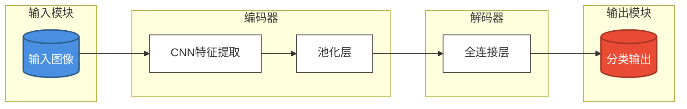

# 功能：AI 驱动的论文 Pipeline 框架图生成器

## 概述

本功能为 Drawnix 白板工具新增一个基于 LLM 的智能论文 Pipeline 框架图生成器。用户通过对话式交互与大模型沟通，描述所需的论文插图需求，系统自动收集信息、生成 Mermaid 代码、转换为 Drawnix 元素，并支持 AI 驱动的样式优化，最终将满意的图表直接插入主画板。

该功能与现有 PaperDraw 功能并行开发，从 `paperdraw` 分支派生新的 `feature/llm-mermaid` 分支进行开发。

## 目标

- **提升论文插图效率**：通过自然语言对话快速生成专业的 Pipeline 框架图
- **降低使用门槛**：用户无需学习 Mermaid 语法，通过对话即可生成复杂图表
- **智能样式推荐**：基于图表结构和用户场景，AI 自动推荐合适的样式方案
- **可扩展架构**：设计时考虑未来扩展到时序图、类图等其他图表类型

## 用户故事

### Story 1：通过对话生成 Pipeline 图

**作为** 一名撰写论文的研究人员
**我想要** 通过自然语言描述我的论文架构
**以便** 快速生成专业的 Pipeline 框架图插入论文中

**验收标准：**
- [ ] 点击顶部工具栏最右侧的按钮可打开生成器对话框
- [ ] 对话框采用左右分栏布局，左侧为对话区，右侧为实时预览区
- [ ] AI 通过混合式提问（预设引导 + 自由补充）收集图表信息
- [ ] 用户描述需求后，系统实时生成 Mermaid 代码并预览
- [ ] 生成的图表以矩形节点为主，支持子图分组
- [ ] 预览区支持缩放和平移查看

### Story 2：AI 驱动的样式优化

**作为** 一名对图表美观度有要求的用户
**我想要** 通过与 AI 对话来调整图表样式
**以便** 获得符合学术规范或个人审美的专业图表

**验收标准：**
- [ ] 首次生成时 AI 自动应用默认样式方案
- [ ] 用户可通过对话描述样式需求（如"更专业"、"输入节点用蓝色"）
- [ ] AI 根据对话重新生成样式方案并实时预览
- [ ] 样式包含：填充颜色、字体颜色、边框粗细、阴影效果
- [ ] 支持多轮对话逐步调整样式

### Story 3：插入主画板

**作为** 一名 Drawnix 用户
**我想要** 将生成的图表插入到主画板中
**以便** 继续编辑或与其他内容组合

**验收标准：**
- [ ] 点击"插入"按钮将图表插入主画板中心位置
- [ ] 插入后对话框自动关闭
- [ ] 插入的元素可被正常编辑（移动、缩放、修改文字等）
- [ ] 插入的元素保持预览时的样式

## 功能需求

### REQ-001：入口按钮

- 在顶部工具栏最右侧新增一个 AI Pipeline 生成器按钮
- 按钮图标需要与现有工具风格保持一致
- 点击按钮打开生成器对话框

### REQ-002：对话框布局

- 采用左右分栏布局：
  - **左侧（40%）**：对话交互区 + 信息收集面板
  - **右侧（60%）**：实时预览区
- 对话框最小尺寸：800px × 600px
- 支持调整对话框大小
- 预览区使用独立的 `Wrapper + Board` 组件渲染

### REQ-003：信息收集结构

AI 需要收集以下信息（通过混合式问答）：

| 信息类别 | 具体内容 | 收集方式 |
|---------|---------|---------|
| 整体布局 | 占据区域范围、密集程度偏好 | 预设选项 + 对话 |
| 模块关系 | 主要模块、模块间的层次关系 | 对话收集 |
| 主题信息 | 图表标题/主题 | 预设输入框 |
| 节点列表 | 具体步骤/模块名称 | 对话收集 |
| 连接关系 | 节点间的数据流向 | 对话收集 |
| 布局方向 | 从左到右 / 从上到下 | 预设选项 |
| 节点形状 | 开始/结束节点形状区分 | 预设选项 |
| 样式偏好 | 专业风格 / 活泼风格 / 学术风格 | 预设选项 + 对话 |
| 目标用途 | 论文插图 / 演示文稿 / 技术文档 | 预设选项 |

### REQ-004：LLM 交互

- 采用混合式交互模式：
  - **预设引导**：结构化表单收集核心信息
  - **自由对话**：允许用户补充描述细节
- 支持多轮对话迭代
- 对话历史保留在当前会话中
- 显示 AI 思考状态（加载指示器）

### REQ-005：Mermaid 代码生成

- AI 生成符合 Mermaid 语法的流程图代码
- 支持以下 Mermaid 特性：
  - ✅ `subgraph` - 子图分组
  - ✅ `classDef` - 自定义样式类
  - ✅ 图标/emoji 支持
  - ✅ 多级嵌套布局
  - ❌ 复杂箭头（暂不需要）
- 使用现有的 `@plait-board/mermaid-to-drawnix` 库进行转换

### REQ-006：样式优化

样式包含以下属性：

| 属性 | 描述 |
|------|------|
| 填充颜色 | 节点背景色，支持按节点类型区分 |
| 字体颜色 | 文字颜色 |
| 边框粗细 | 节点边框宽度 |
| 边框颜色 | 节点边框颜色 |
| 阴影效果 | 节点阴影开关及强度 |
| 字体大小 | 文字大小 |

AI 样式推荐输入：
- 节点文本内容
- 图表结构信息（深度、入度/出度、模块关系）
- 用户描述的用途场景

### REQ-007：API 配置

- 开发阶段：API Key 存储在项目 `.env` 文件中
- 支持兼容 OpenAI API 格式的服务
- 环境变量配置示例：
  ```bash
  VITE_LLM_API_BASE_URL=https://api.openai.com/v1
  VITE_LLM_API_KEY=sk-xxx
  VITE_LLM_MODEL=gpt-4o
  ```

### REQ-008：预览与插入

- 预览区实时显示生成的图表
- 预览区支持基本的缩放操作
- 点击"插入到画板"按钮将元素插入主画板
- 插入位置：主画板当前视图中心
- 插入后自动关闭对话框

## 非功能性需求

### NFR-001：性能要求

- LLM 响应时间：首次生成 < 10 秒，样式调整 < 5 秒
- 预览渲染延迟：< 500ms
- 对话输入响应：< 100ms

### NFR-002：可扩展性

- 对话系统设计支持未来新增图表类型（时序图、类图等）
- 样式系统支持新增样式属性
- LLM 提示词模板化管理

### NFR-003：用户体验

- 加载状态明确（显示骨架屏或加载动画）
- 错误信息友好提示
- 支持键盘快捷键（Ctrl/Cmd + Enter 提交）
- 对话历史可滚动查看

### NFR-004：代码质量

- 遵循项目现有代码规范（2 空格缩进，TypeScript）
- 组件使用 React 19.2.0
- 样式使用 SCSS，与组件共置
- 单元测试覆盖率 > 70%

## 验收标准（测试用例）

### TC-001：基本流程

1. 用户点击顶部工具栏最右侧的 AI Pipeline 按钮
2. 对话框打开，显示左右分栏布局
3. 用户通过对话描述需求："我需要一个图像分类的 pipeline 图"
4. AI 提问引导收集信息
5. 用户回答后，右侧预览区显示生成的图表
6. 用户描述："把输入节点用蓝色，输出节点用红色"
7. 预览区更新显示新样式
8. 用户点击"插入到画板"按钮
9. 图表插入到主画板中心，对话框关闭

### TC-002：复杂嵌套结构

1. 用户描述包含多层子图的 pipeline
2. 系统正确生成包含 `subgraph` 的 Mermaid 代码
3. 预览区正确渲染嵌套结构
4. 样式正确应用到各层级节点

### TC-003：样式调整

1. 用户生成初始图表
2. 用户描述："学术风格，简洁配色"
3. AI 应用对应的样式方案
4. 用户描述："给 Encoder 模块加个虚线边框"
5. 系统更新指定模块的样式

### TC-004：错误处理

1. LLM API 调用失败时显示友好错误提示
2. Mermaid 语法错误时在预览区显示错误信息
3. 网络超时时提供重试选项
4. API Key 未配置时提示配置方法

### TC-005：边界情况

1. 超长节点文本：自动换行或截断
2. 超多节点数量（>50）：提示用户简化或分批生成
3. 空对话提交：提示用户输入需求
4. 重复相同提问：AI 识别并避免重复询问

## 边界情况处理

| 边界情况 | 处理方式 |
|---------|---------|
| LLM 返回无效 Mermaid 代码 | 尝试修复引号问题，失败后提示用户重新描述 |
| 节点数量过多（>50） | 提示用户简化结构，或询问是否继续 |
| 超长对话历史 | 保留最近 20 轮对话，超出部分摘要存储 |
| API Key 未配置 | 显示配置指引，不允许发起 LLM 请求 |
| 生成内容为空 | 提示用户重新描述或提供示例参考 |
| 样式属性不兼容 | 忽略不支持的属性，应用兼容部分 |

## 输出示例

### 对话示例

```
用户：我需要一个图像分类的 pipeline 图

AI：好的，我来帮你生成一个图像分类的 pipeline 图。请先回答几个问题：

1. 这个图的整体布局方向是？
   - 从左到右
   - 从上到下

2. 主要包含哪些模块？（比如：输入层、特征提取、分类器等）

3. 这个图用于什么场景？
   - 论文插图
   - 演示文稿
   - 技术文档

用户：1. 从左到右  2. 输入图像 -> CNN特征提取 -> 全连接层 -> 分类输出  3. 论文插图

AI：明白了，我来生成图表...
[预览区显示图表]

用户：输入节点用蓝色圆角矩形，输出用红色，中间的用白色

AI：好的，我来调整样式...
[预览区更新显示新样式]
```

### 生成的 Mermaid 代码示例



## 范围之外

以下功能**不在本版本范围内**：

- 时序图 (Sequence Diagram) 生成
- 类图 (Class Diagram) 生成
- 状态图 (State Diagram) 生成
- 复杂箭头标签（如 `A --|数据流|--> B`）
- 用户自定义 LLM 提示词模板
- 将生成的图保存为模板
- 导出为其他格式（PNG、SVG 等）
- 批量生成多个图表
- 协作编辑（多用户同时编辑）
- 生产环境的 API Key 管理界面
- LLM 提供商的管理界面（仅支持 .env 配置）

## 技术栈

- **前端框架**：React 19.2.0 + TypeScript
- **绘图库**：Plait (已有) + @plait-board/mermaid-to-drawnix
- **LLM 接口**：兼容 OpenAI API 格式
- **状态管理**：React Hooks (useDrawnix)
- **样式**：SCSS
- **存储**：.env 文件（开发阶段）

## 开发分支

- 基础分支：`paperdraw`
- 新建分支：`feature/llm-mermaid`
- 目标合并分支：待定

## 依赖组件

### 复用现有组件

- `Dialog` / `DialogContent` - 对话框容器
- `TTDDialogPanels` / `TTDDialogPanel` - 面板布局
- `TTDDialogOutput` - 预览输出组件
- `useDrawnix` - 应用状态管理 Hook
- `useI18n` - 国际化 Hook
- `@plait-board/mermaid-to-drawnix` - Mermaid 转换库

### 需新建组件

- `LLMMermaidDialog` - 主对话框组件
- `ChatPanel` - 左侧对话面板
- `PreviewPanel` - 右侧预览面板
- `MessageList` - 对话消息列表
- `MessageInput` - 消息输入组件
- `StyleSuggestionPanel` - 样式建议面板（可选）

---

*文档版本：1.0*
*创建日期：2026-03-15*
