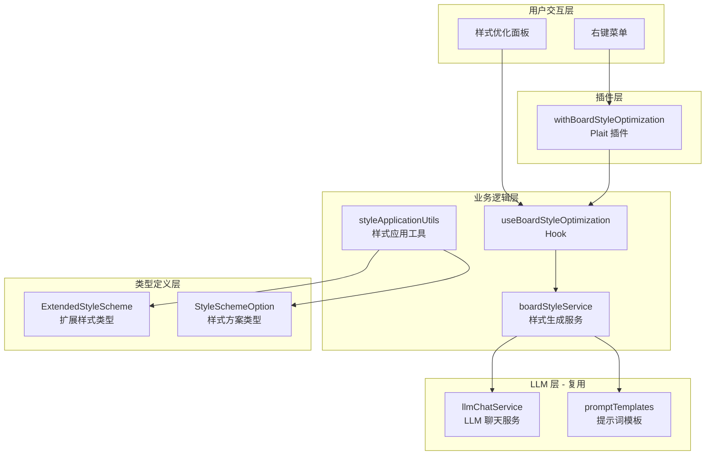

# 实现计划：画板 AI 样式优化增强

## 1. 技术栈

| 类别 | 技术 | 版本 | 说明 |
|------|------|------|------|
| 语言 | TypeScript | 5.x | 项目主要语言 |
| 前端框架 | React | 19.2.0 | 按项目要求 |
| 绘图库 | Plait | 最新 | 现有白板框架 |
| LLM 接口 | OpenAI API 兼容 | - | 复用现有配置 |
| 状态管理 | React Hooks | - | useState, useRef, useCallback |
| 样式 | SCSS | - | 与组件共置 |
| 工具库 | floating-ui | - | 浮动面板定位 |
| 工具库 | ahooks | - | useEventListener 等工具 |

## 2. 合规性审查

| 原则 | 合规性 | 说明 |
|------|--------|------|
| 1. 代码质量 | ✅ | 遵循项目 2 空格缩进、TypeScript 规范 |
| 2. 测试标准 | ✅ | 每个模块编写对应的 `.spec.ts` 测试文件 |
| 3. 文档 | ✅ | 公共 API 添加 TypeScript 注释 |
| 4. 架构 | ✅ | 遵循 Plait 插件模式，关注点分离 |
| 5. 性能 | ✅ | 使用 React.memo、useCallback 优化，避免不必要的重渲染 |
| 6. 安全 | ✅ | 复用现有 API 配置，不暴露敏感信息 |

### 架构决策说明

| 决策 | 宪法原则影响 |
|------|--------------|
| 使用 Plait 插件模式而非独立模块 | 符合"可扩展性"和"可维护性"原则 |
| 复用现有 `styleRecommendationService` | 符合"保持依赖最小化"原则 |
| 将样式应用逻辑封装为独立 Transform | 符合"关注点分离"原则 |

## 3. 架构概览



### 架构说明

1. **用户交互层**：右键菜单项 + 属性面板中的样式优化界面
2. **插件层**：`withBoardStyleOptimization` 插件集成到 Plait Board
3. **业务逻辑层**：处理样式生成、应用逻辑
4. **类型定义层**：扩展的样式类型定义
5. **LLM 层**：复用现有的 LLM 服务和提示词模板

## 4. 组件结构

```
packages/drawnix/src/
├── llm-mermaid/
│   ├── types/
│   │   ├── style.ts                    # [修改] 扩展 StyleScheme
│   │   └── board-style.ts              # [新增] 画板样式类型
│   ├── services/
│   │   ├── style-recommendation.ts     # [修改] 支持多样式方案生成
│   │   └── board-style-service.ts      # [新增] 画板样式生成服务
│   ├── hooks/
│   │   └── use-board-style-optimization.ts  # [新增] 画板样式优化 Hook
│   ├── utils/
│   │   ├── style-applier.ts            # [修改] 支持新样式属性
│   │   └── board-style-application.ts  # [新增] 样式应用到 Plait 元素
│   └── components/
│       └── board-style-panel/          # [新增] 画板样式优化面板
│           ├── index.tsx
│           ├── index.scss
│           ├── style-scheme-card.tsx
│           ├── style-input.tsx
│           └── style-preview.tsx
├── plugins/
│   └── with-board-style-optimization.ts  # [新增] 样式优化插件
├── components/
│   └── context-menu/                    # [新增] 右键菜单组件
│       ├── index.tsx
│       ├── index.scss
│       └── menu-items.tsx
├── transforms/
│   └── board-style.ts                   # [新增] 样式应用 Transform
└── i18n/
    └── translations/
        └── zh-CN.ts                     # [修改] 添加翻译
```

## 5. 模块依赖图

```
┌─────────────────────────────────────┐
│  withBoardStyleOptimization Plugin  │
└──────────────┬──────────────────────┘
               │ depends on
               ▼
┌─────────────────────────────────────┐     ┌──────────────────────┐
│  useBoardStyleOptimization Hook     │────▶│ boardStyleService    │
└──────────────┬──────────────────────┘     └──────────┬───────────┘
               │                                     │
               │ depends on                          │ depends on
               ▼                                     ▼
┌─────────────────────────────────────┐     ┌──────────────────────┐
│  BoardStylePanel Component          │     │ llmChatService      │
└─────────────────────────────────────┘     │ (复用)               │
                                            └──────────────────────┘
                                                    ▲
                                                    │
┌─────────────────────────────────────┐            │
│  styleApplicationUtils              │────────────┘
└─────────────────────────────────────┘
```

## 6. 模块规范

### 模块：扩展样式类型（types/style.ts, types/board-style.ts）

- **职责**：定义扩展的样式属性类型
- **依赖**：无
- **接口**：
  ```typescript
  export interface ExtendedStyleScheme extends StyleScheme {
    opacity?: number;
    gradient?: GradientConfig;
    borderRadius?: number;
    padding?: PaddingConfig;
    lineStyle?: 'straight' | 'curve' | 'orthogonal';
    arrowStyle?: ArrowStyleConfig;
    textAlign?: 'left' | 'center' | 'right';
    verticalAlign?: 'top' | 'middle' | 'bottom';
    icon?: IconConfig;
  }

  export interface StyleSchemeOption {
    id: string;
    name: string;
    description: string;
    styles: ElementStyleMap;
  }

  export interface ElementStyleMap {
    [elementId: string]: ExtendedStyleScheme;
  }
  ```
- **文件**：
  - `packages/drawnix/src/llm-mermaid/types/style.ts` (修改)
  - `packages/drawnix/src/llm-mermaid/types/board-style.ts` (新增)

### 模块：样式生成服务（services/board-style-service.ts）

- **职责**：调用 LLM 生成多个样式方案
- **依赖**：`llmChatService`, `promptTemplates`
- **接口**：
  ```typescript
  class BoardStyleService {
    generateMultipleSchemes(
      elements: PlaitElement[],
      request?: string,
      count?: number
    ): Promise<StyleSchemeOption[]>;
  }
  ```
- **文件**：
  - `packages/drawnix/src/llm-mermaid/services/board-style-service.ts` (新增)
  - `packages/drawnix/src/llm-mermaid/services/prompt-templates.ts` (修改，新增多样式方案提示词)

### 模块：样式应用工具（utils/board-style-application.ts）

- **职责**：将样式应用到 Plait 元素
- **依赖**：`@plait/core` Transforms
- **接口**：
  ```typescript
  export function applyStyleToElements(
    board: PlaitBoard,
    elements: PlaitElement[],
    styleMap: ElementStyleMap
  ): void;

  export function createStyleSnapshot(
    elements: PlaitElement[]
  ): ElementStyleMap;

  export function restoreStyleSnapshot(
    board: PlaitBoard,
    snapshot: ElementStyleMap
  ): void;
  ```
- **文件**：
  - `packages/drawnix/src/llm-mermaid/utils/board-style-application.ts` (新增)

### 模块：画板样式优化 Hook（hooks/use-board-style-optimization.ts）

- **职责**：管理样式优化状态和操作
- **依赖**：`boardStyleService`, `board-style-application`
- **接口**：
  ```typescript
  interface UseBoardStyleOptimizationResult {
    schemes: StyleSchemeOption[];
    isGenerating: boolean;
    error: string | null;
    generateSchemes: (request?: string) => Promise<void>;
    applyScheme: (scheme: StyleSchemeOption) => void;
    previewScheme: (scheme: StyleSchemeOption) => void;
    clearPreview: () => void;
  }
  ```
- **文件**：
  - `packages/drawnix/src/llm-mermaid/hooks/use-board-style-optimization.ts` (新增)

### 模块：画板样式优化面板（components/board-style-panel/）

- **职责**：渲染样式优化 UI
- **依赖**：`use-board-style-optimization`
- **接口**：React 组件
- **文件**：
  - `index.tsx` - 主面板组件
  - `style-scheme-card.tsx` - 样式方案卡片
  - `style-input.tsx` - 样式描述输入框
  - `style-preview.tsx` - 样式预览组件
  - `index.scss` - 样式文件

### 模块：样式优化插件（plugins/with-board-style-optimization.ts）

- **职责**：集成样式优化功能到 Plait Board
- **依赖**：Plait Board API
- **接口**：
  ```typescript
  export function withBoardStyleOptimization(
    board: PlaitBoard
  ): PlaitBoard;
  ```
- **文件**：
  - `packages/drawnix/src/plugins/with-board-style-optimization.ts` (新增)

### 模块：右键菜单（components/context-menu/）

- **职责**：提供右键菜单集成
- **依赖**：现有 Menu 组件
- **接口**：React 组件
- **文件**：
  - `index.tsx` - 菜单组件
  - `menu-items.tsx` - 菜单项定义
  - `index.scss` - 样式文件

## 7. 数据模型

### 扩展样式属性（ExtendedStyleScheme）

| 属性 | 类型 | 默认值 | 描述 |
|------|------|--------|------|
| opacity | number (0-100) | 100 | 透明度百分比 |
| gradient | GradientConfig | - | 渐变配置 |
| borderRadius | number (px) | 0 | 圆角半径 |
| padding | PaddingConfig | - | 内边距配置 |
| lineStyle | 'straight'\|'curve'\|'orthogonal' | - | 连线样式 |
| arrowStyle | ArrowStyleConfig | - | 箭头样式 |
| textAlign | 'left'\|'center'\|'right' | 'center' | 文本水平对齐 |
| verticalAlign | 'top'\|'middle'\|'bottom' | 'middle' | 文本垂直对齐 |
| icon | IconConfig | - | 节点图标 |

### 渐变配置（GradientConfig）

| 属性 | 类型 | 描述 |
|------|------|------|
| type | 'linear'\|'radial' | 渐变类型 |
| colors | string[] | 颜色数组 |
| angle | number (可选) | 线性渐变角度 |
| stops | number[] (可选) | 颜色停止点位置 |

### 箭头样式配置（ArrowStyleConfig）

| 属性 | 类型 | 描述 |
|------|------|------|
| head | 'filled'\|'open'\|'diamond'\|'dot' | 箭头头部样式 |
| size | number (可选) | 箭头大小 |

## 8. API 契约

### LLM 提示词契约

多样式方案生成提示词格式：

```
基于以下图表结构，生成 {count} 个不同的样式方案。

图表信息：
- 节点数量：{nodeCount}
- 边数量：{edgeCount}
- 节点列表：{nodes}

用户要求：{userRequest}

请生成 JSON 格式响应：
{
  "schemes": [
    {
      "id": "scheme-1",
      "name": "方案名称",
      "description": "简短描述",
      "styles": {
        "element-id-1": {
          "fill": "#颜色",
          "stroke": "#颜色",
          ...
        }
      }
    }
  ]
}
```

### 样式应用契约

```typescript
// 应用样式到选中元素
applyStyleToElements(
  board: PlaitBoard,
  elements: PlaitElement[],
  styleMap: ElementStyleMap
): void

// 创建样式快照（用于预览）
createStyleSnapshot(
  elements: PlaitElement[]
): ElementStyleMap

// 恢复样式快照
restoreStyleSnapshot(
  board: PlaitBoard,
  snapshot: ElementStyleMap
): void
```

## 9. 实现阶段

### Phase 1: 基础设施

- [ ] 扩展 `StyleScheme` 类型，添加新样式属性
- [ ] 创建 `board-style-panel` 组件目录结构
- [ ] 创建 `context-menu` 组件目录结构
- [ ] 添加国际化翻译条目
- [ ] 编写类型定义的单元测试

### Phase 2: 核心服务

- [ ] 实现 `boardStyleService.generateMultipleSchemes()`
- [ ] 扩展 `prompt-templates.ts` 支持多样式方案生成
- [ ] 实现 `styleApplicationUtils` 工具函数
- [ ] 实现 `useBoardStyleOptimization` Hook
- [ ] 编写服务层单元测试

### Phase 3: UI 组件

- [ ] 实现 `BoardStylePanel` 主面板组件
- [ ] 实现 `StyleSchemeCard` 方案卡片组件
- [ ] 实现 `StyleInput` 输入组件
- [ ] 实现 `StylePreview` 预览组件
- [ ] 实现右键菜单集成
- [ ] 编写组件单元测试

### Phase 4: 插件集成

- [ ] 实现 `withBoardStyleOptimization` 插件
- [ ] 将插件注册到 `drawnix.tsx`
- [ ] 集成到 `PopupToolbar` 或独立面板
- [ ] 实现撤销/重做支持

### Phase 5: 测试与优化

- [ ] 端到端测试（E2E）
- [ ] 性能优化（大量元素场景）
- [ ] 错误处理完善
- [ ] 用户验收测试

## 10. 技术决策

### 决策 1：样式应用方式

- **选择**：使用 Plait 的 `Transforms.setNode()` API 直接修改元素属性
- **原因**：
  - 符合 Plait 的数据修改范式
  - 自动支持撤销/重做
  - 与现有属性修改逻辑一致
- **替代方案**：
  - 创建新的元素副本替换（会破坏引用，不推荐）
- **权衡**：
  - 需要了解 Plait 的内部 API
  - 但能获得更好的集成和用户体验

### 决策 2：多样式方案生成策略

- **选择**：单次 LLM 调用返回多个方案
- **原因**：
  - 减少网络请求次数
  - 方案之间更容易保持风格差异
  - 成本更低
- **替代方案**：
  - 多次 LLM 调用每次生成一个方案
- **权衡**：
  - 单次响应时间略长
  - 但整体用户体验更好

### 决策 3：面板位置选择

- **选择**：集成到右侧属性面板区域（非浮动）
- **原因**：
  - 不遮挡画板内容
  - 与其他属性设置保持一致
  - 更适合复杂的 UI 交互
- **替代方案**：
  - 浮动面板（会遮挡内容）
  - 对话框模式（打断工作流）
- **权衡**：
  - 需要占用固定面板空间
  - 但提供更好的使用体验

### 决策 4：预览实现方式

- **选择**：临时修改元素样式，鼠标移开恢复
- **原因**：
  - 实现简单，响应快速
  - 用户直观看到效果
- **替代方案**：
  - 在单独画布预览（复杂且不直观）
- **权衡**：
  - 需要保存/恢复样式快照
  - 但预览体验最自然

### 决策 5：新样式属性实现

- **选择**：部分属性使用 Plait 现有能力，部分通过扩展实现
- **原因**：
  - Plait 已支持基础样式（fill, stroke, fontSize）
  - 新增属性（gradient, borderRadius）需要自定义渲染
- **实现策略**：
  - opacity：通过颜色透明度实现
  - gradient：在元素渲染层自定义
  - borderRadius：通过 Plait 的 shape 扩展
  - lineStyle/arrowStyle：使用 Plait 现有 API
- **权衡**：
  - 部分属性需要深入 Plait 内部
  - 但充分利用现有能力减少重复工作

---

*文档版本：1.0*
*创建日期：2026-03-15*
*关联规格：spec.md*
