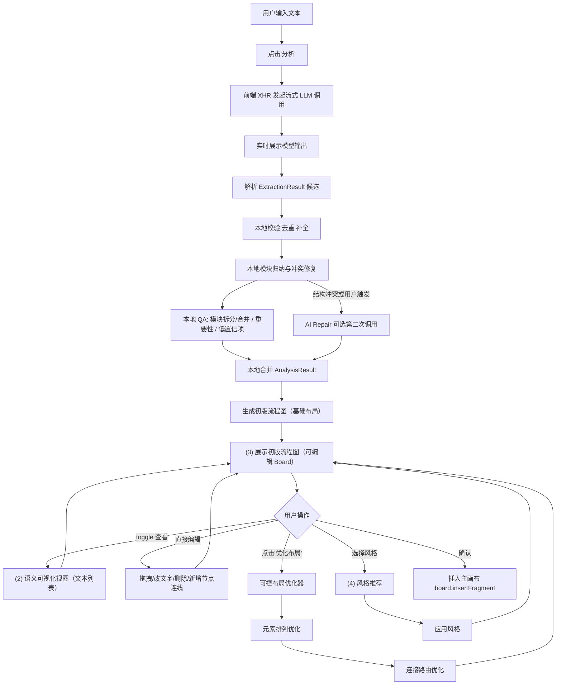

# Drawnix PaperDraw 功能 — PRD 与技术方案 v2.4

> **版本**: v2.4 | **日期**: 2026-03-12 | **状态**: 本地开发中
> **目标**: 基于 PaperDraw 论文，为 Drawnix 实现"自然语言 → 论文级 Pipeline 流程图"

---

## 1. 产品概述

### 1.1 核心理念（对齐论文）

PaperDraw 论文提出三阶段系统：
1. **Text Analyzer** — LLM 流式抽取流程骨架 + 本地 QA 校对 + 本地合并分析结果
2. **Controllable Layout Optimizer** — 多目标优化元素排列 + 连接路由算法
3. **Visual Elements Optimizer** — 风格向量库 + 结构相似性推荐 + 自适应风格应用

**关键设计决策：**
- 文本解析器仍以 **LLM 为核心**，但默认走 **单次 LLM 调用快速路径**
- 当前以 **本地前端直连 + XHR 流式** 为主，不使用 `fetch` 请求模型供应商
- 新增 **实时反馈区**：先展示模型流式输出，再增量展示结构化候选结果
- QA 默认由 **本地规则生成 + 本地合并** 完成；仅在结构冲突或用户主动触发时启用 **AI Repair** 第二次调用
- 节点统一为 **矩形 + 文本**
- 关系分三类：**sequential（顺序连接）**、**modular（模块包含）**、**annotative（注释）**
- **模块是一级结构单元**：模块抽取、模块校验、模块布局优先于单节点顺序排布
- 当实体数较多时，系统必须**强制归纳 2-5 个模块**，不能退化成整张图一条直线
- Text Analyzer 完成后 **先完成语义确认，再立即生成初版流程图**（基础布局），布局优化器由用户 **手动触发**

### 1.2 用户画像

- 学术研究者：从论文方法描述自动生成 pipeline 图
- 技术文档作者：从系统描述生成方法流程图
- 非技术用户：零语法门槛，自然语言输入

### 1.3 当前实现现状（2026-03）

- **已完成**：文本输入、LLM 配置、实体/关系抽取、QA 问题展示、分析结果预览
- **未完成**：初版流程图落板、插入画布、布局优化联动、PaperDraw 专项测试
- **当前范围**：仅面向本地开发，不考虑线上部署、线上密钥管理和生产可用性
- **性能痛点**：当前默认路径需要 3 次串行 LLM 调用，跳过 QA 也仍会再次调模型
- **准确性痛点**：QA 问题缺少原文上下文，本地校验规则偏弱，文案与真实可用能力存在偏差
- **结构痛点**：当前模块抽取不稳定，且模块未参与节点摆放，导致结果经常退化为单条横向链路
- **本次改造目标**：改为“流式单次调用为主 + 本地 QA/合并 + 可选 AI Repair”的快速工作流

---

## 2. 系统架构（四视图模型）

论文 Fig.9 定义了四个核心视图区域，我们对齐实现：

```
+-------------------------------------------------------------+
|                    PaperDraw 弹窗                             |
| +------------------------+  +------------------------------+ |
| | (1) 文本分析视图        |  | (3) 流程图编辑视图            | |
| |  - 文本输入区           |  |  - 初版流程图（可编辑 Board） | |
| |  - "分析"按钮           |  |  - 可直接编辑节点/连线       | |
| |  - 实时模型输出区       |  |  - "优化布局"按钮（手动）    | |
| |  - 本地 QA 校对区       |  |  - 布局交互(选择/缩放/路由)  | |
| +------------------------+  +------------------------------+ |
| | (2) 语义可视化视图       |  | (4) 风格推荐视图             | |
| |  (可选 toggle 展示)     |  |  - 推荐风格列表              | |
| |  - 实体列表+置信度      |  |  - NL 风格指令输入           | |
| |  - 模块分组候选         |  |  - "插入画布"按钮            | |
| |  - 关系预览/警告        |  |                              | |
| +------------------------+  +------------------------------+ |
+-------------------------------------------------------------+
```

### 2.1 核心设计决策

Text Analyzer 不再等所有 AI 步骤全部结束才反馈，而是先把模型流式输出和结构化候选结果展示给用户，再通过本地 QA 与本地合并尽快生成**初版流程图**。只有在本地校验发现结构冲突、或用户主动点击“AI 修复”时，才触发第二次模型调用。布局优化器仍在初版流程图基础上做**增量优化**，由用户手动触发。

- **快速路径**：文本输入 --> 流式 LLM 抽取 --> 本地校验/后处理 --> 本地 QA --> 本地合并 --> 初版流程图
- **实时反馈**：先展示模型流式输出，再增量展示实体、关系、模块候选
- **模块优先**：先形成模块，再确定模块间主流程和模块内结构，避免全局单链排版
- **AI 修复可选**：仅在结构冲突、信息缺失或用户主动触发时执行第二次模型调用
- **用户可编辑**：初版流程图就是标准 Plait 元素，用户可拖拽节点、修改文字、删除/新增连线
- **手动优化**：用户点击"优化布局"按钮触发 Layout Optimizer，在当前图的基础上优化

### 2.2 端到端流程



---

## 3. 三大子系统技术方案

### 3.1 Text Analyzer（文本分析器）

#### 3.1.1 核心功能

1. **实体提取**：从文本中识别关键实体名词（步骤/模块/数据/方法）
2. **流式实时反馈**：模型输出过程中即时展示原始流与结构化候选结果
3. **显式模块抽取**：优先识别阶段、子系统、输入输出簇、方法分段等模块结构
4. **关系提取**：识别实体间的深层语义关系，并附带 evidence / confidence
5. **本地 QA 校对**：针对低置信项、模块拆分/合并和重要性生成本地问题并收集确认
6. **本地合并 / AI Repair**：默认本地生成 AnalysisResult，仅在必要时触发二次 AI 修复
7. **生成初版流程图**：基于模块优先的基础布局立即渲染可编辑的流程图
8. **语义可视化**（可选 toggle）：以文本列表形式展示实体、权重、模块分组和警告信息供对照

#### 3.1.2 三种关系类型（对齐论文 Section 3.2.3）

| 关系类型 | 含义 | 可视化表达 | 示例 |
|---------|------|-----------|------|
| **Sequential（顺序）** | 实体间的顺序/依赖 | 有向箭头连接 | A --> B --> C |
| **Modular（模块）** | 实体属于同一功能模块 | 边界框（bounding box）包含 | {A, B} 属于 "数据准备" |
| **Annotative（注释）** | 层级或补充说明关系 | 虚线/分支线 | A --注释--> B |

说明：

- `Modular` 在模型原始输出中仍可作为中间表达存在
- 进入 validator 和 layout 之前，所有 `modular` 信息都要统一归并为一级 `modules` 结构

#### 3.1.3 数据类型定义

```typescript
// paperdraw/types/analyzer.ts

/** 实体 - 统一为矩形节点 */
interface Entity {
  id: string;
  label: string;         // 实体名称（显示在矩形中）
  evidence?: string;      // 原文溯源片段
  confidence?: number;    // 置信度 0-1
}

/** 顺序关系 - 箭头连接 */
interface SequentialRelation {
  id: string;
  type: 'sequential';
  source: string;         // 源实体 id
  target: string;         // 目标实体 id
  label?: string;         // 连接线上的文字
  evidence?: string;
  confidence?: number;
}

/** 注释关系 - 虚线连接 */
interface AnnotativeRelation {
  id: string;
  type: 'annotative';
  source: string;
  target: string;
  label?: string;
  evidence?: string;
  confidence?: number;
}

type Relation = SequentialRelation | AnnotativeRelation;

/** 一级模块结构 */
interface ModuleGroup {
  id: string;
  label: string;           // 模块名称
  entityIds: string[];     // 模块内实体
  order?: number;          // 模块顺序
  confidence?: number;
  evidence?: string;       // 模块归纳依据
}

/** LLM 初步提取结果 */
interface ExtractionResult {
  entities: Entity[];
  relations: Relation[];
  modules: ModuleGroup[];   // 模块候选，允许后处理修正
  warnings?: string[];     // 去重/补全/冲突检测后的提示
}

/** 经本地 QA / AI Repair 确认后的完整分析结果 */
interface AnalysisResult {
  entities: Entity[];
  relations: Relation[];
  weights: Record<string, number>;  // 实体id -> 重要性权重 0-1
  modules: ModuleGroup[];           // 确认后的模块分组
}
```

设计约束：

- `modules` 是一级结构输入，布局阶段必须优先消费 `modules`
- 当 `entities.length >= 5` 时，`ExtractionResult.modules` 不允许为空；至少需要 2 个模块候选
- 兼容旧数据时，可先接收 `modular relation`，但 validator 必须统一归并为 `modules`

#### 3.1.4 LLM 调用策略（流式快速路径）

```typescript
// paperdraw/analyzer/llm-client.ts

interface LLMTransport {
  streamChat(
    config: LLMConfig,
    messages: ChatMessage[],
    handlers: {
      onDelta: (chunk: string) => void;
      onFinal: (content: string) => void;
      onError: (error: Error) => void;
    }
  ): { abort: () => void };
}
```

调用策略：

- **本地开发阶段采用前端直连**；使用 XHR 对接 OpenAI-compatible 接口，不使用 `fetch`
- **默认开启流式返回**，前端先展示 `onDelta` 的原始内容，提升可感知速度
- 模型最终必须输出可解析的 `final_json`，其中包含 `entities / relations / modules / evidence / confidence`
- 当实体数 `>= 5` 时，prompt 必须要求模型显式归纳 `2-5` 个模块，即使原文没有直接出现“模块/阶段”字样
- 前端在 `onFinal` 后执行本地校验、去重、补边、孤点检测、模块归纳修正和低置信项标注
- 当本地规则无法修复冲突时，再进入可选的 **AI Repair** 第二次调用

模块抽取规则：

- 优先使用显式结构词：`阶段`、`模块`、`子系统`、`流程`、`输入`、`输出`
- 若无显式结构词，则根据段落边界、顺序链断点、同类动词短语和共享宾语进行归纳
- 单个模块建议包含 `2-6` 个实体；过大模块需要拆分候选，单实体模块默认降级为普通节点
- 当模块数少于 2 且实体数较多时，本地规则必须二次聚类，不能直接放弃模块结构

#### 3.1.5 本地 QA 校对器（默认） + AI Repair（可选）

默认不再让 LLM 生成多轮 QA 问题，而是由本地规则针对“需要用户确认的点”生成最少量的问题：

- **模块拆分/合并确认**：当模块过大、过小或边界冲突时，询问是否拆分或合并
- **重要性确认**：当多个主干节点竞争核心地位时，询问哪个更重要
- **低置信项确认**：当实体/关系置信度低于阈值时，提示用户保留、合并或删除

```typescript
// paperdraw/analyzer/crs-agent.ts

function generateLocalQuestions(
  extraction: ExtractionResult,
): CRSQuestion[];

function mergeLocalAnswers(
  extraction: ExtractionResult,
  answers: CRSAnswer[]
): AnalysisResult;

async function repairWithAI(
  extraction: ExtractionResult,
  answers: CRSAnswer[],
  issues: string[],
  llmConfig: LLMConfig
): Promise<AnalysisResult>;
```

关键规则：

- `skip QA` 表示接受默认值，直接本地合并，不再额外发起 LLM 请求
- 本地合并负责生成 `weights`、整理 `modules`、同步 `relations`
- 若 `entities.length >= 5` 且 `modules.length < 2`，默认合并前必须执行一次本地模块重建
- QA 默认优先问模块问题，再问重要性问题，避免用户先看到结构错误的单链图
- 仅当存在结构冲突、缺失关键边或用户主动点击“AI 修复”时，才执行 `repairWithAI`

#### 3.1.6 基础布局（初版流程图生成）

流式抽取 + 本地 QA / AI Repair 完成后，立即使用简单布局算法生成初版流程图：

```typescript
// paperdraw/layout/basic-layout.ts

/**
 * 基础布局：模块优先的两层布局
 * - 先按模块顺序确定一级结构
 * - 模块之间默认 LR 排布
 * - 模块内部按 TB 或小型网格排布
 * - 注释节点侧挂，不挤占主流程
 * - 耗时 < 100ms，同步执行
 */
export function basicLayout(
  analysis: AnalysisResult,
  direction: 'LR' | 'TB' = 'LR'
): LayoutResult {
  // 1. 先计算模块顺序和模块间主链
  const orderedModules = sortModules(analysis.modules, analysis.relations);

  // 2. 在每个模块内部做顺序布局
  const nodes = assignModuleAwarePositions(orderedModules, analysis.entities, {
    moduleDirection: 'LR',
    innerDirection: 'TB',
    compactGridThreshold: 4,
  });

  // 3. 基于模块节点计算 group bounds
  const groups = computeGroupBounds(nodes, orderedModules);

  // 4. 顺序边走主流向，注释边走侧挂连线
  const edges = computeStructuredEdges(analysis.relations, nodes, groups);

  return { nodes, edges, groups, metrics: computeMetrics(nodes, edges, groups) };
}
```

生成后立即转换为 PlaitElement[] 并加载到可编辑 Board 中。

基础布局约束：

- 模块间默认 `LR`，模块内默认 `TB`
- 实体较多时允许模块内部使用 2 列网格，避免过长竖列
- 注释关系优先挂在所属模块右侧或下侧，不占用主链位置
- 若模块缺失，先执行本地模块归纳；只有实体极少时才允许退化为纯顺序布局

### 3.2 Controllable Layout Optimizer（可控布局优化器）

> **触发方式**: 用户在初版流程图上手动点击"优化布局"按钮触发。
> 优化器读取当前 Board 上的元素状态（用户可能已手动编辑过），进行增量优化。

当前仓库现状补充：

- 当前仓库已经接入 **`elkjs`**，第二阶段从“本地启发式 MVP”升级为“**ELK 主优化器 + 本地 fallback**”
- “优化布局”不再只是重新渲染原图，而是支持 **整体重排** 与 **选区局部重排**
- 本地启发式优化器继续保留，用于 ELK 失败、超时或局部边界边的兜底路由
- 当前重点从“先接通按钮”切换为“**布局最优 + 局部重排 + 边界连接合理**”

#### 3.2.1 基础布局 vs 优化布局

| | 基础布局（Text Analyzer 后立即生成） | 优化布局（用户手动触发） |
|---|---|---|
| **触发时机** | 自动，本地 QA / AI Repair 完成后立即 | 手动，用户点击"优化布局" |
| **算法** | 模块优先两层布局 | ELK 层次化布局 + 正交路由，失败时回退本地启发式 |
| **耗时** | < 100ms（同步） | < 2s（Web Worker） |
| **可编辑性** | 生成后即可编辑 | 优化后仍可编辑 |
| **尊重用户编辑** | - | 保留用户固定/移动的节点 |

当前第二阶段拆分为两个层次：

1. **ELK 主优化器（本轮实现）**
   - 整体重排：对整张图做层次化布局和正交路由
   - 选区局部重排：只重排用户选中的矩形节点和相关箭头
   - 模块层级通过 compound node / hierarchy handling 保留
2. **本地 fallback 路由器（本轮保留）**
   - 当 ELK 失败或局部边界边效果不理想时，继续使用走廊 lane + waypoint 兜底

#### 3.2.2 多目标优化（论文 Section 4.3.1）

三个优化目标：
- **空白最小化**（公式1）：最大化空间利用效率
- **视觉信息流 VIF**（公式2）：连续方向夹角 > 90度 扣分，保持阅读流连贯
- **边界框几何**（公式3）：贴合目标宽高比（单栏 / 双栏格式）

当前实现策略：

- **目标 1：全局布局更优**
  - 使用 ELK layered 算法优化层级、顺序和模块层次
- **目标 2：线条更少交叉**
  - 默认启用 ELK 正交路由
- **目标 3：支持局部优化**
  - 用户可选择部分矩形节点/箭头，只重排该区域
- **目标 4：边界连接合理**
  - 选区与未选区之间的边在 ELK 后继续做本地二次整理
- **目标 5：保留回退能力**
  - ELK 超时或异常时，自动回退到本地启发式优化

后续升级策略：在 ELK 结果之上继续增加评分驱动的多目标微调

#### 3.2.3 连接路由 - ELK 正交路由 + 本地边界优化

当前默认由 ELK 输出正交 bend points，再映射回 `LayoutEdge.routing`。对于局部重排后连接选区与未选区的边，以及 ELK 输出不稳定的边，再使用本地路由器兜底。

当前路由规则：

- **整体重排**：由 ELK 直接输出层次化节点位置与正交折线
- **局部重排内部边**：由 ELK 对选区子图输出 bend points
- **局部重排边界边**：用本地走廊路由重新连接选区与未选区
- **注释边**：若 ELK 效果不理想，优先回退到模块侧挂走廊
- **异常回退**：ELK 失败时，整图回退到 `optimizeLayout()`

技术实现：

- `LayoutEdge.routing` 作为 ELK bend points 的标准承载字段
- builder 在创建 elbow line 后写入 `element.points = routing`
- 预览板在初次生成和手动优化后做一次 route stabilization
- “优化布局”按钮触发的是当前 draft 上的 ELK 优化，而不是重新跑文本分析

#### 3.2.4 关键数据结构

```typescript
// paperdraw/types/layout.ts

interface LayoutNode {
  id: string;
  x: number; y: number;
  width: number; height: number;
  label: string;
  weight: number;
  pinned?: boolean;  // 用户手动固定的节点，优化时不移动
}

interface LayoutEdge {
  id: string;
  sourceId: string;
  targetId: string;
  routing?: [number, number][];  // 显式 waypoint，优化布局阶段可填充
  type: 'sequential' | 'annotative';
}

interface LayoutGroup {
  id: string;
  moduleLabel: string;
  nodeIds: string[];
  x: number; y: number;
  width: number; height: number;
}

interface LayoutResult {
  nodes: LayoutNode[];
  edges: LayoutEdge[];
  groups: LayoutGroup[];
  metrics: {
    blankSpaceScore: number;
    vifScore: number;
    geometryScore: number;
    crossings: number;
  };
}
```

#### 3.2.5 当前需要补齐的实现点

按当前代码现状，第二阶段优先补这 6 项：

1. `paperdraw/layout/elk-layout.ts`
   - ELK graph 构建、输出映射、局部重排子图构建
2. `paperdraw/layout/elk-layout.worker.ts`
   - 在 worker 中运行 ELK，避免阻塞 UI
3. `paperdraw/layout/optimize-layout.ts`
   - 继续承担 fallback 和边界边兜底
4. `paperdraw/builder/flowchart-builder.ts`
   - 提供 `buildElkOptimizedFlowchartState()`
5. `paperdraw/components/paperdraw-dialog.tsx`
   - “重排已选区域 / 整体重排”菜单入口与状态切换
6. `paperdraw/layout/*.spec.ts`
   - 增加 ELK 全局优化、局部重排、fallback 与 routing 测试

### 3.3 Visual Elements Optimizer（视觉元素优化器）

#### 3.3.1 论文五大设计原则（P1-P5）

| 编号 | 原则 | 实现 |
|------|------|------|
| P1 | 元素对齐 | 同行共享基线/居中 |
| P2 | 空间效率 | 紧凑布局 |
| P3 | 标准化尺寸 | 论文单/双栏格式 |
| P4 | 连接路由 | 最少交叉，自然阅读序 |
| P5 | 颜色编码一致 | 同模块同颜色族 |

#### 3.3.2 颜色编码规则（论文 Section 3.2.4）

- **相似性法则**：同模块实体使用同一颜色族
- **前景/背景**：模块背景浅色填充，实体白底深边框
- **高亮**：高权重实体用更饱和色调强调

#### 3.3.3 风格模板定义（含完整样式属性）

3 套预定义模板，每套包含以下完整样式属性：

```typescript
// paperdraw/visual/templates.ts

interface StyleTemplate {
  id: string;
  name: string;

  // 矩形节点样式
  node: {
    fill: string;              // 矩形填充颜色
    stroke: string;            // 矩形边框颜色
    strokeWidth: number;       // 矩形边框粗细
    borderRadius: number;      // 圆角半径
    shadow?: {                 // 阴影
      color: string;
      offsetX: number;
      offsetY: number;
      blur: number;
    };
  };

  // 文本样式
  text: {
    color: string;             // 文本颜色
    fontSize: number;          // 文本大小
    fontWeight: number | string; // 文本粗细 (400/500/600/700)
    fontFamily: string;        // 字体族
    lineHeight: number;        // 行高
  };

  // 连接线样式
  edge: {
    stroke: string;            // 线条颜色
    strokeWidth: number;       // 线条粗细
    arrowType: 'stealth' | 'open' | 'filled';
  };

  // 注释线样式
  annotativeEdge: {
    stroke: string;
    strokeWidth: number;
    strokeDash: number[];      // 虚线模式 [4, 3]
  };

  // 模块分组样式
  group: {
    fill: string;              // 模块背景填充
    stroke: string;            // 模块边框颜色
    strokeWidth: number;
    labelColor: string;        // 模块标签颜色
    labelFontSize: number;
    labelFontWeight: number | string;
  };

  // 模块配色序列（按模块顺序分配）
  modulePalette: string[];

  // 高权重实体强调
  highlight: {
    strokeWidthMultiplier: number;  // 边框加粗倍数
    fillOpacity: number;            // 填充浅色模块色的透明度
  };
}
```

**3 套默认模板：**

| 模板 | 特点 |
|------|------|
| `academic-default` | 白底深边框，Inter 字体，学术配色板，轻阴影 |
| `minimal-bw` | 纯黑白，无阴影，细边框，高对比 |
| `tech-blue` | 蓝色系渐变，深色边框，现代感阴影 |

后续迭代引入论文的风格向量库（tree kernel 结构相似性检索）。

---

## 4. 前端集成方案

### 4.1 代码修改清单

| # | 文件 | 操作 | 说明 |
|---|------|------|------|
| 1 | `use-drawnix.tsx` | MODIFY | `DialogType` 新增 `paperdrawToFlowchart` |
| 2 | `menu-items.tsx` | MODIFY | 新增 `PaperDrawItem` 菜单项 |
| 3 | `ttd-dialog.tsx` | MODIFY | 新增 PaperDraw 对话框 |
| 4 | `paperdraw/` 目录 | NEW | 全部新增模块（analyzer/layout/visual/builder/components） |
| 5 | `icons.tsx` + i18n | MODIFY | 图标和文案 |

### 4.2 状态机

```typescript
type PaperDrawPhase =
  | 'input'           // 用户输入文本
  | 'analyzing'       // 流式抽取 / 可选 AI Repair 中，持续展示模型输出
  | 'qa'              // 本地 QA 校对轮次
  | 'draft_flowchart' // 初版流程图（基础布局，可编辑 Board）
  | 'optimizing'      // 用户点击"优化布局"后，Layout Optimizer 运行中
  | 'editing'         // 优化后继续编辑/调整
  | 'styling';        // 风格选择/调整
```

核心流转：
```
input -> analyzing -> qa -> draft_flowchart <-> optimizing <-> editing -> styling -> 插入画布
                               ^                                           |
                               +-------------------------------------------+
```

- `draft_flowchart`: 进入此阶段即可看到初版流程图，Board 可编辑
- `analyzing`: 持续展示流式模型输出和结构化候选结果
- 用户可在 `draft_flowchart` / `editing` 阶段随时直接编辑节点
- 用户可随时 toggle 查看语义文本视图（不改变阶段）

### 4.3 目录结构

```
packages/drawnix/src/paperdraw/
+-- types/              # 类型定义
+-- analyzer/
|   +-- llm-client.ts   # XHR 流式请求 + 输出解析
|   +-- crs-agent.ts    # 本地 QA 生成/本地合并/可选 AI Repair
|   +-- validator.ts    # 结构校验 + 去重补全 + 规则修复
+-- layout/
|   +-- basic-layout.ts # 基础布局（初版流程图用）
|   +-- elk-layout.ts   # ELK 优化布局 + 正交路由
|   +-- optimizer.ts    # 多目标优化
|   +-- worker.ts       # Web Worker 封装
+-- visual/
|   +-- templates.ts    # 3 套风格模板（含完整样式属性）
|   +-- color-engine.ts # 模块配色引擎
+-- builder/            # PlaitElement 构建（严格矩形）
+-- components/         # UI 组件
+-- pipeline.ts         # 编排层
```

---

## 5. 里程碑

| 阶段 | 内容 | 估时 |
|------|------|------|
| **M-A** | 类型定义 + 流式 LLM Transport + 弹窗骨架 | 5-8 人日 |
| **M-B** | LLM 文本抽取 + 实时展示 + 本地 QA/合并 + 语义可视化 | 10-15 人日 |
| **M-C** | 基础布局（初版流程图） + ELK 优化布局 + 连接路由 | 10-15 人日 |
| **M-D** | 视觉优化 + 模板库 + PlaitElement 构建 | 8-12 人日 |
| **M-E** | 端到端集成 + 可编辑 Board + 交互式调整 + E2E 测试 | 8-12 人日 |
| **M-F** | 风格向量库检索 + NL 风格指令 | 10-20 人日 |

---

## 6. 已确认事项

**流程与交互：**
- Text Analyzer 默认走“**单次流式调用 + 本地 QA/合并**”快速路径
- Text Analyzer 完成后立即生成**初版流程图**（基础布局），无需等待布局优化器
- 分析过程中要先展示**实时模型输出**，再逐步展示结构化候选结果
- 初版流程图必须体现**模块组织结构**，在实体较多时不能退化成单条横向链路
- 初版流程图使用**可编辑 Board**（非只读），用户可直接拖拽/编辑
- 语义文本视图（实体列表/权重/模块）作为**可选 toggle**，用户按需查看
- 布局优化器由**用户手动触发**（点击"优化布局"按钮）
- 优化器需**尊重用户已做的编辑**（已固定节点位置不被覆盖）

**技术选型：**
- **LLM 接口**：使用 OpenAI 兼容接口（统一 API 格式，可对接 OpenAI/DeepSeek/Qwen 等）
- **调用方式**：本地前端直连 OpenAI-compatible 接口，使用 XHR 流式请求，不使用 `fetch`
- **环境范围**：当前仅支持本地 `.env.local` 开发配置，暂不考虑线上部署与生产密钥管理
- **QA 策略**：默认本地规则生成与本地合并；用户可选择**跳过 QA** 直接走默认值
- **模块策略**：模块是一级结构单元；当实体数较多时必须强制归纳 `2-5` 个模块
- **基础布局**：采用“模块间 LR + 模块内 TB/网格 + 注释侧挂”的组织方式
- **AI Repair**：仅在结构冲突、信息缺失或用户主动触发时执行第二次模型调用
- **风格模板**：MVP 3 套（academic-default / minimal-bw / tech-blue），含完整样式属性（填充色、线条色/粗细、文本色/大小/粗细、阴影等）
- **节点形状**：严格全部使用**矩形**
- **布局算法**：使用 ELK 成熟算法（含正交路由），不自研 MultiRect-CenterLine
