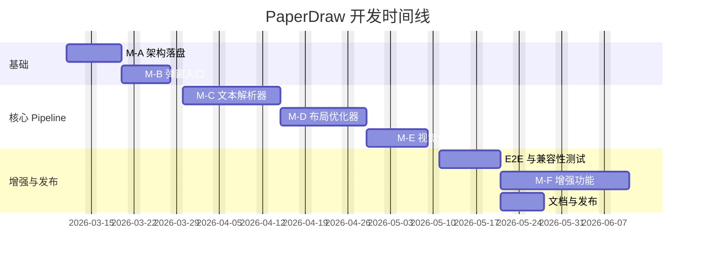

# Drawnix PaperDraw 功能 — 产品需求文档（PRD）与技术方案

> **版本**: v1.0 | **日期**: 2026-03-11 | **状态**: 草案
> **目标**: 基于 PaperDraw 论文三段式思路，为 Drawnix 新增"自然语言文本 → 流程图"的自动生成与优化能力

---

## 1. 产品概述

### 1.1 背景

Drawnix 当前已有两种"文本到图"（TTD）能力：
- **Mermaid → 流程图/序列图/类图**
- **Markdown → 思维导图**

两者均通过 Extra Tools 菜单 → TTD 弹窗实现，采用"输入-预览-插入"的产品模式。

本次新增第三种 TTD 能力——**PaperDraw**：用户输入自然语言文本（如论文方法描述、实验流程等），系统自动生成结构化、论文级的流程图，并插入画布。

### 1.2 核心价值

| 维度 | 现有 TTD | PaperDraw 新增 |
|------|---------|---------------|
| 输入门槛 | 需掌握 Mermaid/Markdown 语法 | 自然语言，零语法门槛 |
| 图质量 | 依赖用户手写语法质量 | 自动布局优化 + 风格美化 |
| 适用场景 | 开发者/技术文档 | 论文写作、报告、教学、任何流程描述 |

### 1.3 用户画像

- **学术研究者**：需要从论文段落快速生成方法流程图
- **技术文档作者**：从系统描述生成架构/流程图
- **教育场景**：从教学内容生成可视化流程
- **非技术用户**：不会 Mermaid 语法但需要流程图

---

## 2. 功能需求

### 2.1 用户故事地图

```
US-1: 作为用户，我可以在 Extra Tools 菜单中找到"智能生成流程图"入口
US-2: 作为用户，我可以在弹窗中输入/粘贴自然语言文本
US-3: 作为用户，我可以实时看到从文本生成的流程图预览
US-4: 作为用户，我可以选择布局方向（左右/上下）
US-5: 作为用户，我可以选择视觉风格模板（论文风/极简/科技蓝）
US-6: 作为用户，我可以将生成的流程图一键插入主画布
US-7: 作为用户，插入后可以像普通元素一样编辑（拖拽/修改文本/删除节点）
US-8: 作为用户，我可以对已有流程图一键"重新布局"或"应用风格"
```

### 2.2 功能清单与优先级

| 编号 | 功能 | 优先级 | 里程碑 |
|------|------|--------|--------|
| F-01 | PaperDraw 弹窗入口（DialogType 扩展） | P0 | M-B |
| F-02 | 文本输入面板（支持粘贴/输入，字数统计） | P0 | M-B |
| F-03 | 只读预览面板（复用 TTDDialogOutput） | P0 | M-B |
| F-04 | 文本解析器 — 规则版 MVP | P0 | M-C |
| F-05 | 文本解析器 — LLM API 接入 | P1 | M-C |
| F-06 | ELK/Dagre 自动布局 | P0 | M-D |
| F-07 | Web Worker 异步布局 | P0 | M-D |
| F-08 | 布局方向控制（LR/TB） | P1 | M-D |
| F-09 | 模板风格库 v1（3套） | P0 | M-E |
| F-10 | 形状语义映射（terminal/process/decision/data） | P0 | M-E |
| F-11 | 模块配色一致性 | P0 | M-E |
| F-12 | 对比度检查（WCAG AA） | P1 | M-E |
| F-13 | 自然语言风格指令 | P2 | M-F |
| F-14 | 交互式澄清（确认模块/节点） | P2 | M-F |
| F-15 | 选区一键重排优化 | P2 | M-F |
| F-16 | .drawnix 元数据扩展（可选） | P2 | M-F |

### 2.3 交互流程

```mermaid
flowchart TB
    A[用户点击 Extra Tools] --> B[选择"智能生成流程图"]
    B --> C[打开 PaperDraw 弹窗]
    C --> D[左侧：输入自然语言文本]
    D --> E{文本长度 > 0?}
    E -->|否| F[显示占位提示]
    E -->|是| G[触发解析 Pipeline]
    G --> H[文本解析器：抽取节点/边]
    H --> I[布局优化器：计算坐标]
    I --> J[视觉优化器：应用风格]
    J --> K[右侧：只读预览 Board]
    K --> L{用户操作}
    L -->|调整布局方向| M[重新布局]
    M --> K
    L -->|切换风格| N[重新应用风格]
    N --> K
    L -->|插入画布| O[board.insertFragment]
    O --> P[主画布显示，可编辑]
    L -->|关闭| Q[关闭弹窗]
```

---

## 3. 系统架构

### 3.1 整体架构

```mermaid
graph TB
    subgraph 前端 ["前端 (packages/drawnix)"]
        UI["PaperDraw 弹窗 UI"]
        TP["TextParser 文本解析模块"]
        LO["LayoutOptimizer 布局模块"]
        VO["VisualOptimizer 视觉模块"]
        EB["ElementBuilder PlaitElement 构建"]
        PV["Preview Board 预览"]
    end

    subgraph Worker ["Web Worker"]
        LW["Layout Worker (ELK)"]
    end

    subgraph Backend ["可选后端 (REST API)"]
        LLM["LLM 推理服务"]
        NLP["NLP 校验服务"]
    end

    UI -->|原始文本| TP
    TP -->|FlowIR| LO
    LO -->|委托计算| LW
    LW -->|LayoutResult| LO
    LO -->|LayoutResult| VO
    VO -->|StyledElements| EB
    EB -->|PlaitElement[]| PV
    PV -->|确认插入| UI

    TP -.->|可选| LLM
    TP -.->|可选| NLP
```

### 3.2 数据流契约 — 三大中间表示

Pipeline 核心是三个阶段性数据结构，解耦各子系统：

**阶段 1: FlowIR** — 文本解析器输出

```typescript
// packages/drawnix/src/paperdraw/types/flow-ir.ts

interface FlowNode {
  id: string;
  label: string;
  type: 'start' | 'end' | 'process' | 'decision' | 'data' | 'subprocess';
  module?: string;        // 所属模块/阶段
  weight?: number;        // 重要性 0-1
  evidence?: {            // 原文溯源
    span: string;
    offset: [number, number];
  };
}

interface FlowEdge {
  id: string;
  source: string;
  target: string;
  type: 'sequence' | 'conditional' | 'data_flow';
  label?: string;
  condition?: string;     // 决策条件文本
}

interface FlowIR {
  docId: string;
  language: 'zh' | 'en';
  title?: string;
  nodes: FlowNode[];
  edges: FlowEdge[];
  modules?: string[];     // 模块列表
  constraints?: {
    direction: 'LR' | 'TB' | 'RL' | 'BT';
    groupByModule: boolean;
    preferOrthogonalEdges: boolean;
  };
}
```

**阶段 2: LayoutResult** — 布局优化器输出

```typescript
// packages/drawnix/src/paperdraw/types/layout-result.ts

interface LayoutNode {
  id: string;
  x: number;
  y: number;
  width: number;
  height: number;
  portHints?: ('N' | 'S' | 'E' | 'W')[];
}

interface LayoutEdge {
  id: string;
  sourceId: string;
  targetId: string;
  routing: [number, number][];
  style: 'orthogonal' | 'polyline' | 'bezier';
}

interface LayoutGroup {
  id: string;
  module: string;
  nodeIds: string[];
  x: number;
  y: number;
  width: number;
  height: number;
  padding: number;
}

interface LayoutMetrics {
  crossings: number;
  edgeLengthSum: number;
  whitespaceRatio: number;
  aspectRatio: number;
}

interface LayoutResult {
  layoutId: string;
  nodes: LayoutNode[];
  edges: LayoutEdge[];
  groups: LayoutGroup[];
  metrics: LayoutMetrics;
}
```

**阶段 3: StylePlan** — 视觉优化器输出

```typescript
// packages/drawnix/src/paperdraw/types/style-plan.ts

interface StylePlan {
  templateId: string;
  templateName: string;
  palette: Record<string, string>;  // module名 → 颜色
  defaultPalette: {
    border: string;
    text: string;
    background: string;
    edgeStroke: string;
    groupBorder: string;
    groupFill: string;
  };
  typography: {
    fontFamily: string;
    fontSize: number;
    lineHeight: number;
  };
  shapeMapping: Record<FlowNode['type'], string>;  // → Plait shape 标识
  edgeStyle: {
    strokeWidth: number;
    arrowType: 'stealth' | 'open' | 'filled';
    routing: 'orthogonal' | 'polyline';
  };
  constraints: {
    minContrastRatio: number;  // WCAG AA: 4.5
  };
}
```

---

## 4. 子系统技术方案

### 4.1 文本解析器 (TextParser)

#### 4.1.1 架构设计

```
用户文本 → 预处理 → 段落切分 → 步骤抽取 → 关系识别 → IR 构建 → 校验 → FlowIR
```

#### 4.1.2 文件结构

```
packages/drawnix/src/paperdraw/
├── types/
│   ├── flow-ir.ts              # FlowIR 类型定义
│   ├── layout-result.ts        # LayoutResult 类型定义
│   └── style-plan.ts           # StylePlan 类型定义
├── parser/
│   ├── index.ts                # 统一入口 parseTextToIR()
│   ├── preprocessor.ts         # 文本预处理（清洗、分段）
│   ├── step-extractor.ts       # 步骤/节点抽取
│   ├── relation-extractor.ts   # 关系/边抽取
│   ├── module-detector.ts      # 模块/分组检测
│   ├── ir-builder.ts           # FlowIR 组装
│   ├── ir-validator.ts         # Schema 校验
│   ├── llm-adapter.ts          # LLM API 适配器（可选）
│   └── dictionaries/
│       ├── zh-flow-keywords.json   # 中文流程关键词
│       └── en-flow-keywords.json   # 英文流程关键词
├── layout/
│   ├── index.ts
│   ├── elk-layout.ts
│   ├── layout-worker.ts
│   ├── layout-worker.worker.ts
│   ├── post-optimizer.ts
│   └── size-measurer.ts
├── visual/
│   ├── index.ts
│   ├── style-engine.ts
│   ├── contrast-checker.ts
│   └── templates/
│       ├── paper-default.ts
│       ├── minimal-bw.ts
│       └── tech-blue.ts
├── builder/
│   ├── index.ts                # IR+Layout+Style → PlaitElement[]
│   └── element-factory.ts
├── pipeline.ts                 # 端到端 Pipeline 编排
└── constants.ts
```

#### 4.1.3 核心算法 — 规则版 MVP

**预处理器** (`preprocessor.ts`)
```typescript
export function preprocess(text: string): ProcessedText {
  // 1. 去除多余空白、特殊字符
  // 2. 按段落/换行分割
  // 3. 识别标题/小标题（模块标记）
  // 4. 返回 { paragraphs, headings, rawText }
}
```

**步骤抽取器** (`step-extractor.ts`)
- 关键词匹配：中文 `"首先|然后|接着|之后|最后|同时|此外|如果|否则|当...时"` 等
- 句子分割后，每个含动作动词的句子 → 候选节点
- 节点类型推断规则：
  - 含 `"开始|启动|初始化"` → `start`
  - 含 `"结束|完成|输出结果"` → `end`
  - 含 `"如果|是否|判断|检查"` → `decision`
  - 含 `"数据|输入|输出|文件"` → `data`
  - 默认 → `process`

**关系抽取器** (`relation-extractor.ts`)
- 顺序关系：相邻步骤默认 `sequence`
- 分支关系：`"如果...则...否则..."` → 从 decision 节点分两条 conditional 边
- 并行关系：`"同时|并行|与此同时"` → 标记为并行组

**模块检测器** (`module-detector.ts`)
- 基于标题层级（如 `"一、数据准备"、"二、模型训练"`）
- 基于显式分组词（`"阶段"、"步骤"、"模块"`）
- 将节点按模块标签分组

#### 4.1.4 LLM 适配器（P1 可选）

```typescript
// parser/llm-adapter.ts
export interface LLMAdapter {
  parseText(text: string, options: LLMParseOptions): Promise<FlowIR>;
}

interface LLMParseOptions {
  model: string;           // e.g. 'gpt-4o', 'qwen-max', 'deepseek-chat'
  apiKey: string;          // 从环境变量获取，不硬编码
  maxTokens: number;
  temperature: number;
  systemPrompt: string;    // 结构化输出 prompt
  jsonSchema: object;      // FlowIR schema for structured output
}
```

Prompt 设计要点：
- System Prompt 明确要求输出 FlowIR JSON
- Few-shot 示例：3-5 个"文本→IR"样本
- JSON Schema 校验（使用 LLM 的结构化输出能力）
- 失败重试：带错误信息的 self-correct prompt

#### 4.1.5 回退策略

```
LLM 解析 → (超时/失败) → 规则解析 → (低质量) → 提示用户手动调整
```

每个回退层都输出相同的 FlowIR，上层无感知。

#### 4.1.6 关键词词典示例

```json
// dictionaries/zh-flow-keywords.json
{
  "sequence_connectors": ["首先", "然后", "接着", "之后", "随后", "最后", "紧接着"],
  "parallel_connectors": ["同时", "并行", "与此同时", "一方面...另一方面"],
  "branch_connectors": ["如果", "若", "当", "是否", "否则", "不然", "条件"],
  "start_keywords": ["开始", "启动", "初始化", "触发"],
  "end_keywords": ["结束", "完成", "输出", "返回结果", "终止"],
  "data_keywords": ["数据", "文件", "数据集", "输入", "输出", "参数"],
  "module_markers": ["阶段", "步骤", "模块", "部分", "环节"]
}
```

### 4.2 布局优化器 (LayoutOptimizer)

#### 4.2.1 技术选型：ELK (elkjs)

选择 ELK 的理由：
- **Sugiyama 层次布局**适合有向流程图
- **elkjs** 纯 JavaScript，支持 Web Worker
- **丰富配置**：方向、间距、端口、正交路由
- 比 Dagre 功能更强，支持分组/嵌套布局

#### 4.2.2 ELK 布局配置

```typescript
// layout/elk-layout.ts
import ELK from 'elkjs/lib/elk.bundled.js';

const DEFAULT_ELK_OPTIONS = {
  'elk.algorithm': 'layered',
  'elk.direction': 'RIGHT',                    // 或 DOWN
  'elk.layered.spacing.nodeNodeBetweenLayers': '80',
  'elk.layered.spacing.edgeNodeBetweenLayers': '40',
  'elk.spacing.nodeNode': '40',
  'elk.layered.nodePlacement.strategy': 'NETWORK_SIMPLEX',
  'elk.edgeRouting': 'ORTHOGONAL',
  'elk.layered.crossingMinimization.strategy': 'LAYER_SWEEP',
  'elk.layered.mergeEdges': 'true',
};

export async function elkLayout(
  ir: FlowIR,
  nodeSizes: Map<string, { width: number; height: number }>
): Promise<LayoutResult> {
  const elk = new ELK();

  const graph = {
    id: 'root',
    layoutOptions: {
      ...DEFAULT_ELK_OPTIONS,
      'elk.direction': ir.constraints?.direction === 'TB' ? 'DOWN' : 'RIGHT',
    },
    children: ir.nodes.map(node => {
      const size = nodeSizes.get(node.id) ?? { width: 160, height: 60 };
      return {
        id: node.id,
        width: size.width,
        height: size.height,
        labels: [{ text: node.label }],
      };
    }),
    edges: ir.edges.map(edge => ({
      id: edge.id,
      sources: [edge.source],
      targets: [edge.target],
      labels: edge.label ? [{ text: edge.label }] : [],
    })),
  };

  // 如果需要按模块分组
  if (ir.constraints?.groupByModule && ir.modules?.length) {
    graph.children = ir.modules.map(mod => ({
      id: `group_${mod}`,
      layoutOptions: { 'elk.padding': '[top=30,left=20,bottom=20,right=20]' },
      children: ir.nodes
        .filter(n => n.module === mod)
        .map(node => ({
          id: node.id,
          width: nodeSizes.get(node.id)?.width ?? 160,
          height: nodeSizes.get(node.id)?.height ?? 60,
        })),
    }));
  }

  const result = await elk.layout(graph);
  return convertELKResult(result, ir);
}
```

#### 4.2.3 Web Worker 化

```typescript
// layout/layout-worker.worker.ts
import ELK from 'elkjs/lib/elk.bundled.js';

self.onmessage = async (event) => {
  const { ir, nodeSizes, options } = event.data;
  try {
    const elk = new ELK();
    const result = await elkLayout(elk, ir, nodeSizes, options);
    self.postMessage({ type: 'success', result });
  } catch (error) {
    self.postMessage({ type: 'error', error: error.message });
  }
};

// layout/layout-worker.ts — 主线程封装
export function layoutInWorker(
  ir: FlowIR,
  nodeSizes: Map<string, { width: number; height: number }>
): Promise<LayoutResult> {
  return new Promise((resolve, reject) => {
    const worker = new Worker(
      new URL('./layout-worker.worker.ts', import.meta.url),
      { type: 'module' }
    );
    worker.onmessage = (e) => {
      if (e.data.type === 'success') resolve(e.data.result);
      else reject(new Error(e.data.error));
      worker.terminate();
    };
    worker.postMessage({ ir, nodeSizes: Object.fromEntries(nodeSizes) });
  });
}
```

#### 4.2.4 二次优化 (Post-Optimizer)

在 ELK 布局后，应用论文式启发式优化：

```typescript
// layout/post-optimizer.ts
export function postOptimize(layout: LayoutResult): LayoutResult {
  let optimized = { ...layout };

  // 1. 栅格对齐：将节点 x/y 吸附到 grid
  optimized = snapToGrid(optimized, gridSize: 20);

  // 2. 同层对齐：确保同一层级节点 y 坐标一致
  optimized = alignSameLayer(optimized);

  // 3. 间距均匀化：相邻节点间距标准化
  optimized = normalizeSpacing(optimized, minGap: 40);

  // 4. 分组边界更新：重新计算 group bbox + padding
  optimized = updateGroupBounds(optimized, padding: 20);

  // 5. 边路由优化：减少穿越 group 的边
  optimized = optimizeEdgeRouting(optimized);

  // 6. 计算质量指标
  optimized.metrics = computeMetrics(optimized);

  return optimized;
}
```

#### 4.2.5 节点尺寸测量

复用现有 Mermaid 转换中的文本尺寸测量方式：

```typescript
// layout/size-measurer.ts
export function measureNodeSizes(
  nodes: FlowNode[],
  typography: StylePlan['typography']
): Map<string, { width: number; height: number }> {
  const canvas = document.createElement('canvas');
  const ctx = canvas.getContext('2d')!;
  ctx.font = `${typography.fontSize}px ${typography.fontFamily}`;

  const sizes = new Map();
  for (const node of nodes) {
    const textMetrics = ctx.measureText(node.label);
    const textWidth = textMetrics.width;
    const paddingH = 40;  // 水平内边距
    const paddingV = 20;  // 垂直内边距
    sizes.set(node.id, {
      width: Math.max(textWidth + paddingH, 120),
      height: typography.fontSize * typography.lineHeight + paddingV,
    });
  }
  return sizes;
}
```

### 4.3 视觉元素优化器 (VisualOptimizer)

#### 4.3.1 风格模板定义

```typescript
// visual/templates/paper-default.ts
export const PAPER_DEFAULT: StylePlan = {
  templateId: 'paper.default.v1',
  templateName: '论文风格',
  palette: {},  // 运行时按模块分配
  defaultPalette: {
    border: '#2F2F2F',
    text: '#111111',
    background: '#FFFFFF',
    edgeStroke: '#666666',
    groupBorder: '#CCCCCC',
    groupFill: '#F8F8F8',
  },
  typography: {
    fontFamily: 'Inter, "Noto Sans SC", sans-serif',
    fontSize: 14,
    lineHeight: 1.4,
  },
  shapeMapping: {
    start: 'terminal',        // 圆角矩形
    end: 'terminal',
    process: 'rectangle',     // 矩形
    decision: 'diamond',      // 菱形
    data: 'parallelogram',    // 平行四边形
    subprocess: 'rectangle',  // 双边矩形
  },
  edgeStyle: {
    strokeWidth: 2,
    arrowType: 'stealth',
    routing: 'orthogonal',
  },
  constraints: {
    minContrastRatio: 4.5,
  },
};
```

#### 4.3.2 模块配色引擎

```typescript
// visual/style-engine.ts

// 学术配色板（高对比、色盲友好）
const ACADEMIC_PALETTE = [
  '#4E79A7', '#F28E2B', '#E15759', '#76B7B2',
  '#59A14F', '#EDC948', '#B07AA1', '#FF9DA7',
];

export function assignModuleColors(
  modules: string[],
  basePalette: string[] = ACADEMIC_PALETTE
): Record<string, string> {
  const palette: Record<string, string> = {};
  modules.forEach((mod, i) => {
    palette[mod] = basePalette[i % basePalette.length];
  });
  return palette;
}

export function applyStyle(
  ir: FlowIR,
  layout: LayoutResult,
  template: StylePlan
): StylePlan {
  const palette = assignModuleColors(
    ir.modules ?? [],
    ACADEMIC_PALETTE
  );
  return { ...template, palette };
}
```

#### 4.3.3 对比度检查

```typescript
// visual/contrast-checker.ts
export function checkContrast(
  foreground: string,
  background: string,
  minRatio: number = 4.5
): { ratio: number; passes: boolean } {
  const fgLum = relativeLuminance(parseHex(foreground));
  const bgLum = relativeLuminance(parseHex(background));
  const ratio = (Math.max(fgLum, bgLum) + 0.05)
              / (Math.min(fgLum, bgLum) + 0.05);
  return { ratio, passes: ratio >= minRatio };
}
```

### 4.4 PlaitElement 构建器 (ElementBuilder)

将三大中间表示合并为 Plait 可渲染的元素数组。

```typescript
// builder/element-factory.ts
import { createGeometryElement, createArrowLineElement } from '@plait/draw';

export function buildPlaitElements(
  ir: FlowIR,
  layout: LayoutResult,
  style: StylePlan
): PlaitElement[] {
  const elements: PlaitElement[] = [];

  // 1. 创建节点元素
  for (const node of layout.nodes) {
    const irNode = ir.nodes.find(n => n.id === node.id)!;
    const shape = style.shapeMapping[irNode.type];
    const moduleColor = irNode.module
      ? style.palette[irNode.module]
      : undefined;

    const element = createGeometryElement(
      /* shape */ shape,
      /* points */ [[node.x, node.y], [node.x + node.width, node.y + node.height]],
      /* text */ irNode.label,
      /* options */ {
        fill: moduleColor ?? style.defaultPalette.background,
        strokeColor: style.defaultPalette.border,
        strokeWidth: style.edgeStyle.strokeWidth,
      }
    );
    elements.push(element);
  }

  // 2. 创建边元素
  for (const edge of layout.edges) {
    const irEdge = ir.edges.find(e => e.id === edge.id)!;
    const arrowElement = createArrowLineElement(
      /* routing */ edge.routing,
      /* options */ {
        strokeColor: style.defaultPalette.edgeStroke,
        strokeWidth: style.edgeStyle.strokeWidth,
        arrowType: style.edgeStyle.arrowType,
        label: irEdge.label,
        // boundId 绑定到对应节点
        sourceHandle: { boundId: edge.sourceId },
        targetHandle: { boundId: edge.targetId },
      }
    );
    elements.push(arrowElement);
  }

  // 3. 创建分组元素
  for (const group of layout.groups) {
    // 使用 Plait Group 元素封装
    const groupElement = createGroupElement(
      group.nodeIds,
      [[group.x, group.y],
       [group.x + group.width, group.y + group.height]],
      { label: group.module }
    );
    elements.push(groupElement);
  }

  return elements;
}
```

### 4.5 Pipeline 编排

```typescript
// pipeline.ts
export interface PipelineOptions {
  direction?: 'LR' | 'TB';
  template?: StylePlan;
  useLLM?: boolean;
  llmConfig?: LLMParseOptions;
  abortSignal?: AbortSignal;
  onProgress?: (stage: string, progress: number) => void;
}

export async function runPaperDrawPipeline(
  text: string,
  options: PipelineOptions = {}
): Promise<{ elements: PlaitElement[]; ir: FlowIR; metrics: LayoutMetrics }> {
  const {
    direction = 'LR',
    template = PAPER_DEFAULT,
    useLLM = false,
    abortSignal,
    onProgress,
  } = options;

  // Stage 1: 文本解析
  onProgress?.('parsing', 0);
  let ir: FlowIR;
  if (useLLM && options.llmConfig) {
    try {
      ir = await llmAdapter.parseText(text, options.llmConfig);
    } catch {
      ir = await ruleBasedParse(text);  // 回退
    }
  } else {
    ir = await ruleBasedParse(text);
  }
  ir.constraints = { ...ir.constraints, direction };
  checkAbort(abortSignal);
  onProgress?.('parsing', 100);

  // Stage 2: 尺寸测量
  onProgress?.('measuring', 0);
  const nodeSizes = measureNodeSizes(ir.nodes, template.typography);
  onProgress?.('measuring', 100);

  // Stage 3: 布局
  onProgress?.('layout', 0);
  let layoutResult = await layoutInWorker(ir, nodeSizes);
  layoutResult = postOptimize(layoutResult);
  checkAbort(abortSignal);
  onProgress?.('layout', 100);

  // Stage 4: 视觉优化
  onProgress?.('styling', 0);
  const stylePlan = applyStyle(ir, layoutResult, template);
  onProgress?.('styling', 100);

  // Stage 5: 构建元素
  onProgress?.('building', 0);
  const elements = buildPlaitElements(ir, layoutResult, stylePlan);
  onProgress?.('building', 100);

  return { elements, ir, metrics: layoutResult.metrics };
}

function checkAbort(signal?: AbortSignal) {
  if (signal?.aborted) {
    throw new DOMException('Pipeline aborted', 'AbortError');
  }
}
```

---

## 5. 前端集成方案

### 5.1 DialogType 扩展

```typescript
// hooks/use-drawnix.tsx 修改
export enum DialogType {
  mermaidToDrawnix = 'mermaidToDrawnix',
  markdownToDrawnix = 'markdownToDrawnix',
  paperdrawToFlowchart = 'paperdrawToFlowchart',  // 新增
}
```

### 5.2 菜单入口

```typescript
// components/toolbar/extra-tools/menu-items.tsx 新增
export const PaperDrawItem = () => {
  const { appState, setAppState } = useDrawnix();
  const { t } = useI18n();
  return (
    <MenuItem
      data-testid="paperdraw-to-flowchart-button"
      onSelect={() => {
        setAppState({
          ...appState,
          openDialogType: DialogType.paperdrawToFlowchart,
        });
      }}
      icon={PaperDrawIcon}
      aria-label={t('extraTools.paperDrawToFlowchart')}
    >
      {t('extraTools.paperDrawToFlowchart')}
    </MenuItem>
  );
};
```

### 5.3 弹窗组件

```typescript
// components/ttd-dialog/ttd-dialog.tsx 新增一段 Dialog
<Dialog
  open={appState.openDialogType === DialogType.paperdrawToFlowchart}
  onOpenChange={(open) => {
    setAppState({
      ...appState,
      openDialogType: open ? DialogType.paperdrawToFlowchart : null,
    });
  }}
>
  <DialogContent className="Dialog ttd-dialog ttd-dialog--paperdraw" container={container}>
    <PaperDrawToFlowchart />
  </DialogContent>
</Dialog>
```

### 5.4 PaperDraw 主组件

```typescript
// components/ttd-dialog/paperdraw-to-flowchart.tsx
const PaperDrawToFlowchart = () => {
  const { appState, setAppState } = useDrawnix();
  const { t } = useI18n();
  const board = useBoard();

  const [text, setText] = useState('');
  const [value, setValue] = useState<PlaitElement[]>([]);
  const [error, setError] = useState<Error | null>(null);
  const [loading, setLoading] = useState(false);
  const [progress, setProgress] = useState({ stage: '', percent: 0 });
  const [direction, setDirection] = useState<'LR' | 'TB'>('LR');
  const [templateId, setTemplateId] = useState('paper.default.v1');
  const abortRef = useRef<AbortController | null>(null);

  const deferredText = useDeferredValue(text.trim());

  // 生成 Pipeline
  const generateFlowchart = useCallback(async () => {
    if (!deferredText) return;
    abortRef.current?.abort();
    abortRef.current = new AbortController();

    setLoading(true);
    setError(null);
    try {
      const template = getTemplateById(templateId);
      const result = await runPaperDrawPipeline(deferredText, {
        direction,
        template,
        abortSignal: abortRef.current.signal,
        onProgress: (stage, percent) => setProgress({ stage, percent }),
      });
      setValue(result.elements);
    } catch (err: any) {
      if (err.name !== 'AbortError') setError(err);
    } finally {
      setLoading(false);
    }
  }, [deferredText, direction, templateId]);

  // 插入画布（复用 Mermaid 的逻辑）
  const insertToBoard = () => { /* 同 mermaid-to-drawnix.tsx */ };

  return (
    <>
      <div className="ttd-dialog-desc">{t('dialog.paperdraw.description')}</div>
      {/* 顶部控制栏：方向选择 + 模板选择 */}
      <div className="paperdraw-controls">
        <DirectionPicker value={direction} onChange={setDirection} />
        <TemplatePicker value={templateId} onChange={setTemplateId} />
      </div>
      <TTDDialogPanels>
        <TTDDialogPanel label={t('dialog.paperdraw.input')}>
          <TTDDialogInput
            input={text}
            placeholder={t('dialog.paperdraw.placeholder')}
            onChange={(e) => setText(e.target.value)}
            onKeyboardSubmit={generateFlowchart}
          />
          <button onClick={generateFlowchart} disabled={loading}>
            {loading ? t('dialog.paperdraw.generating') : t('dialog.paperdraw.generate')}
          </button>
          {loading && <ProgressBar stage={progress.stage} percent={progress.percent} />}
        </TTDDialogPanel>
        <TTDDialogPanel
          label={t('dialog.paperdraw.preview')}
          panelAction={{
            action: insertToBoard,
            label: t('dialog.paperdraw.insert'),
          }}
          renderSubmitShortcut={() => <TTDDialogSubmitShortcut />}
        >
          <TTDDialogOutput value={value} loaded={!loading} error={error} />
        </TTDDialogPanel>
      </TTDDialogPanels>
    </>
  );
};
```

---

## 6. 数据格式兼容

### 6.1 .drawnix 文件扩展

新增**可选** `paperdraw` 字段，不破坏 `isValidDrawnixData` 的最小校验：

```typescript
// data/json.ts serializeAsJSON 扩展
{
  type: 'drawnix',
  version: 1,
  source: 'web',
  elements: [...],
  viewport: {...},
  theme: {...},
  // 新增可选字段
  paperdraw?: {
    flowIr: FlowIR,       // 可选：仅在需要"可追溯"时存储
    templateId: string,
    generatedAt: number,
  }
}
```

`isValidDrawnixData` 只检查 `type/elements/viewport`，新字段不会破坏校验。

---

## 7. 非功能性需求

| 维度 | 要求 | 验收标准 |
|------|------|---------|
| **性能 — 解析** | 文本 < 2000字，规则版 < 500ms | 对标 10 条测试用例 |
| **性能 — 布局** | ≤50 节点 < 300ms, ≤200 节点 < 2s | Web Worker 不阻塞 UI |
| **可用性** | 主流浏览器（Chrome/Firefox/Safari 最近 2 版本） | E2E 测试覆盖 |
| **可访问性** | 颜色对比度 ≥ 4.5:1 (WCAG AA) | 对比度检查器自动校验 |
| **兼容性** | 生成的元素与现有 Plait 元素完全一致 | 可拖拽/编辑/导出 |
| **稳定性** | 同一 IR 多次布局结果一致 | 固定 seed 回归测试 |

---

## 8. 测试方案

### 8.1 单元测试

| 模块 | 测试内容 | 工具 |
|------|---------|------|
| TextParser | 节点抽取、边抽取、类型推断 | Vitest |
| LayoutOptimizer | ELK 配置、栅格对齐、指标计算 | Vitest |
| VisualOptimizer | 模板应用、配色分配、对比度 | Vitest |
| ElementBuilder | PlaitElement 生成正确性 | Vitest |
| Pipeline | 端到端集成、回退、取消 | Vitest |

### 8.2 测试用例集
```
TC-01: 单链条 "A→B→C" → 3节点2边
TC-02: 含分支 "如果X则A否则B" → decision+2 conditional边
TC-03: 含并行 "同时执行A和B" → 并行组
TC-04: 含模块 "数据准备、训练、评估" → 3个group
TC-05: 空文本 → 友好提示
TC-06: 超长文本(>5000字) → 返回结果或提示截断
TC-07: 英文文本 → 正常解析
TC-08: 混合中英文 → 正常解析
TC-09: 仅标题无内容 → 合理降级
TC-10: 完整论文方法段落 → 生成可用流程图
```

### 8.3 E2E 测试

```
E2E-01: 输入文本 → 预览 → 插入 → 导出 .drawnix → 重新导入
E2E-02: 切换布局方向 → 预览更新
E2E-03: 切换模板 → 预览更新
E2E-04: 关闭弹窗 → 取消进行中的 Pipeline
```

---

## 9. 里程碑与排期

| 里程碑 | 内容 | 估时 | 依赖 |
|--------|------|------|------|
| **M-A** 架构落盘 | TypeScript 类型定义、IR 契约、Mock 数据 | 5-8 人日 | — |
| **M-B** 弹窗入口 | DialogType 扩展、菜单项、弹窗骨架、预览复用 | 4-6 人日 | M-A |
| **M-C** 文本解析器 | 规则版 MVP + 可选 LLM 适配器 | 10-15 人日 | M-A |
| **M-D** 布局优化器 | ELK 集成 + Worker + 后处理 | 8-12 人日 | M-C |
| **M-E** 视觉优化器 | 3套模板 + 配色引擎 + 对比度 | 6-10 人日 | M-D |
| **M-F** 增强功能 | NL风格指令、交互式澄清、选区优化 | 10-20 人日 | M-E |



---

## 10. 关键代码修改清单

| # | 文件 | 操作 | 说明 |
|---|------|------|------|
| 1 | [use-drawnix.tsx](file:///Users/bytedance/Documents/upc/draw_xcl/drawnix/packages/drawnix/src/hooks/use-drawnix.tsx) | MODIFY | 新增 `DialogType.paperdrawToFlowchart` |
| 2 | [menu-items.tsx](file:///Users/bytedance/Documents/upc/draw_xcl/drawnix/packages/drawnix/src/components/toolbar/extra-tools/menu-items.tsx) | MODIFY | 新增 `PaperDrawItem` 菜单项 |
| 3 | [ttd-dialog.tsx](file:///Users/bytedance/Documents/upc/draw_xcl/drawnix/packages/drawnix/src/components/ttd-dialog/ttd-dialog.tsx) | MODIFY | 新增 PaperDraw Dialog |
| 4 | `paperdraw-to-flowchart.tsx` | NEW | PaperDraw 弹窗主组件 |
| 5 | `paperdraw/types/*.ts` | NEW | FlowIR/LayoutResult/StylePlan 类型 |
| 6 | `paperdraw/parser/*.ts` | NEW | 文本解析器模块 |
| 7 | `paperdraw/layout/*.ts` | NEW | 布局优化器模块 |
| 8 | `paperdraw/visual/*.ts` | NEW | 视觉优化器模块 |
| 9 | `paperdraw/builder/*.ts` | NEW | PlaitElement 构建器 |
| 10 | `paperdraw/pipeline.ts` | NEW | Pipeline 编排 |
| 11 | [icons.tsx](file:///Users/bytedance/Documents/upc/draw_xcl/drawnix/packages/drawnix/src/components/icons.tsx) | MODIFY | 新增 PaperDraw 图标 |
| 12 | i18n 文件 | MODIFY | 新增中英文文案 |

---

## 11. 风险与缓解

| 风险 | 影响 | 缓解措施 |
|------|------|---------|
| 规则解析器覆盖有限 | 复杂文本生成质量低 | LLM 回退 + 用户手动调整 |
| ELK 布局与 Plait 连接点不匹配 | 连线显示错误 | 严格对齐 ArrowLineHandle.boundId |
| LLM API 不稳定/成本 | 影响可用性 | 纯本地规则兜底，LLM 为可选增强 |
| 颜色对比度不达标 | 可读性差 | 自动对比度检查 + 修正 |
| 新增字段破坏兼容性 | 旧版本无法打开 | 可选字段扩展 + 只校验最小集 |
