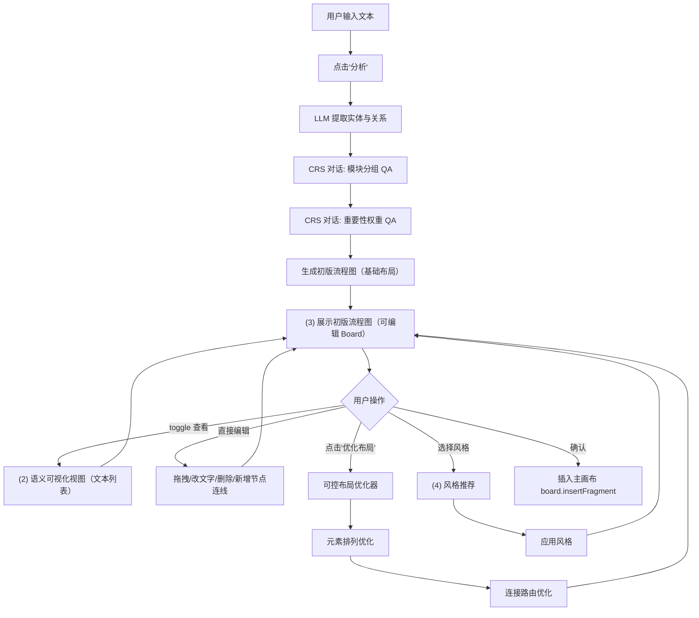

# Drawnix PaperDraw 功能 — PRD 与技术方案 v2.1

> **版本**: v2.1 | **日期**: 2026-03-11 | **状态**: 讨论中
> **目标**: 基于 PaperDraw 论文，为 Drawnix 实现"自然语言 → 论文级 Pipeline 流程图"

---

## 1. 产品概述

### 1.1 核心理念（对齐论文）

PaperDraw 论文提出三阶段系统：
1. **Text Analyzer** — LLM 提取实体/关系 + CRS 对话代理迭代确认用户意图
2. **Controllable Layout Optimizer** — 多目标优化元素排列 + 连接路由算法
3. **Visual Elements Optimizer** — 风格向量库 + 结构相似性推荐 + 自适应风格应用

**关键设计决策：**
- 文本解析器以 **LLM 为核心**
- 新增 **用户 QA 交互环节**（CRS 模式）
- 节点统一为 **矩形 + 文本**
- 关系分三类：**sequential（顺序连接）**、**modular（模块包含）**、**annotative（注释）**
- Text Analyzer 完成后 **立即生成初版流程图**（基础布局），布局优化器由用户 **手动触发**

### 1.2 用户画像

- 学术研究者：从论文方法描述自动生成 pipeline 图
- 技术文档作者：从系统描述生成方法流程图
- 非技术用户：零语法门槛，自然语言输入

---

## 2. 系统架构（四视图模型）

论文 Fig.9 定义了四个核心视图区域，我们对齐实现：

```
+-------------------------------------------------------------+
|                    PaperDraw 弹窗                             |
| +------------------------+  +------------------------------+ |
| | (1) 文本分析视图        |  | (3) 流程图编辑视图            | |
| |  - 文本输入区           |  |  - 初版流程图（可编辑 Board） | |
| |  - "分析"按钮           |  |  - 可直接编辑节点/连线       | |
| |  - QA 问答区域          |  |  - "优化布局"按钮（手动）    | |
| |    (CRS 多轮对话)       |  |  - 布局交互(选择/缩放/路由)  | |
| +------------------------+  +------------------------------+ |
| | (2) 语义可视化视图       |  | (4) 风格推荐视图             | |
| |  (可选 toggle 展示)     |  |  - 推荐风格列表              | |
| |  - 实体列表+权重        |  |  - NL 风格指令输入           | |
| |  - 模块分组关系         |  |  - "插入画布"按钮            | |
| |  - 连接关系图           |  |                              | |
| +------------------------+  +------------------------------+ |
+-------------------------------------------------------------+
```

### 2.1 核心设计决策

Text Analyzer 完成后，系统已经拥有完整的流程图逻辑骨架（实体 + 关系 + 模块分组 + 权重），此时立即用基础布局渲染出**初版流程图**，用户可以直接看到、直接编辑。布局优化器是在这个基础上做**增量优化**，由用户手动触发。

- **初版流程图**：Text Analyzer --> 基础自动布局（简单左右/上下排列） --> 生成 PlaitElement[] --> 可编辑 Board
- **语义视图可选**：用户可 toggle 切换查看文本列表形式（实体、权重、模块分组）
- **用户可编辑**：初版流程图就是标准 Plait 元素，用户可拖拽节点、修改文字、删除/新增连线
- **手动优化**：用户点击"优化布局"按钮触发 Layout Optimizer，在当前图的基础上优化

### 2.2 端到端流程



---

## 3. 三大子系统技术方案

### 3.1 Text Analyzer（文本分析器）

#### 3.1.1 核心功能

1. **实体提取**：从文本中识别关键实体名词（步骤/模块/数据/方法）
2. **关系提取**：识别实体间的深层语义关系
3. **CRS 对话代理**：通过多轮 QA 确认模块分组和重要性权重
4. **生成初版流程图**：基于 AnalysisResult 用基础布局立即渲染可编辑的流程图
5. **语义可视化**（可选 toggle）：以文本列表形式展示实体、权重、模块分组供对照

#### 3.1.2 三种关系类型（对齐论文 Section 3.2.3）

| 关系类型 | 含义 | 可视化表达 | 示例 |
|---------|------|-----------|------|
| **Sequential（顺序）** | 实体间的顺序/依赖 | 有向箭头连接 | A --> B --> C |
| **Modular（模块）** | 实体属于同一功能模块 | 边界框（bounding box）包含 | {A, B} 属于 "数据准备" |
| **Annotative（注释）** | 层级或补充说明关系 | 虚线/分支线 | A --注释--> B |

#### 3.1.3 数据类型定义

```typescript
// paperdraw/types/analyzer.ts

/** 实体 - 统一为矩形节点 */
interface Entity {
  id: string;
  label: string;         // 实体名称（显示在矩形中）
  evidence?: string;      // 原文溯源片段
}

/** 顺序关系 - 箭头连接 */
interface SequentialRelation {
  id: string;
  type: 'sequential';
  source: string;         // 源实体 id
  target: string;         // 目标实体 id
  label?: string;         // 连接线上的文字
}

/** 模块关系 - 边界框包含 */
interface ModularRelation {
  id: string;
  type: 'modular';
  moduleLabel: string;    // 模块名称
  entityIds: string[];    // 包含的实体 id 列表
}

/** 注释关系 - 虚线连接 */
interface AnnotativeRelation {
  id: string;
  type: 'annotative';
  source: string;
  target: string;
  label?: string;
}

type Relation = SequentialRelation | ModularRelation | AnnotativeRelation;

/** LLM 初步提取结果 */
interface ExtractionResult {
  entities: Entity[];
  relations: Relation[];
}

/** 经 CRS 确认后的完整分析结果 */
interface AnalysisResult {
  entities: Entity[];
  relations: Relation[];
  weights: Record<string, number>;  // 实体id -> 重要性权重 0-1
  modules: ModularRelation[];       // 确认后的模块分组
}
```

#### 3.1.4 LLM Prompt 设计

```typescript
// paperdraw/analyzer/llm-client.ts

const EXTRACTION_SYSTEM_PROMPT = `
你是一个学术论文流程图生成助手。给定一段描述研究方法/流程的文本，你需要：
1. 提取所有关键实体（步骤、模块、数据、方法名等）
2. 识别实体间的关系：
   - sequential: 顺序/依赖关系（A 之后是 B）
   - modular: 模块包含关系（A 和 B 属于同一阶段/模块）
   - annotative: 注释/补充关系
3. 以 JSON 格式输出

输出格式：
{
  "entities": [{"id": "e1", "label": "实体名称", "evidence": "原文片段"}],
  "relations": [
    {"id": "r1", "type": "sequential", "source": "e1", "target": "e2"},
    {"id": "r2", "type": "modular", "moduleLabel": "模块名", "entityIds": ["e1","e2"]},
    {"id": "r3", "type": "annotative", "source": "e3", "target": "e4"}
  ]
}
`;
```

#### 3.1.5 CRS 对话代理（核心交互）

论文 Section 4.2.2 的 Conversational Agent，两类问题迭代确认：

**问题类型 1 - 模块分组：**
```
Q: "以下哪些实体应该属于同一个模块？"
   [文本解析] [LLM推理] [实体提取] [关系识别]
   用户选择 -> 确认分组
```

**问题类型 2 - 重要性权重：**
```
Q: "以下实体中，哪个对整体流程贡献更大？"
   [文本解析器] [布局优化器]
   用户选择 -> 调整权重排序
```

```typescript
// paperdraw/analyzer/crs-agent.ts

interface CRSQuestion {
  id: string;
  type: 'module_grouping' | 'importance_ranking';
  question: string;
  options: string[];        // 可选实体标签
  multiSelect: boolean;     // 模块分组允许多选
}

interface CRSAnswer {
  questionId: string;
  selectedOptions: string[];
}

/** 基于 LLM 和提取结果生成 QA 问题 */
async function generateQuestions(
  extraction: ExtractionResult,
  llmConfig: LLMConfig
): Promise<CRSQuestion[]>;

/** 根据用户回答让 LLM 更新分析结果 */
async function refineWithAnswers(
  extraction: ExtractionResult,
  answers: CRSAnswer[],
  llmConfig: LLMConfig
): Promise<AnalysisResult>;
```

#### 3.1.6 基础布局（初版流程图生成）

Text Analyzer + CRS QA 完成后，立即使用简单布局算法生成初版流程图：

```typescript
// paperdraw/layout/basic-layout.ts

/**
 * 基础布局：简单拓扑排序 + 等间距排列
 * - 按 sequential 关系拓扑排序确定节点顺序
 * - 按 direction（LR/TB）等间距排列
 * - 模块用简单 bounding box 包裹
 * - 耗时 < 100ms，同步执行
 */
export function basicLayout(
  analysis: AnalysisResult,
  direction: 'LR' | 'TB' = 'LR'
): LayoutResult {
  // 1. 拓扑排序 sequential 关系
  const sorted = topologicalSort(analysis.entities, analysis.relations);

  // 2. 按方向等间距排列
  const nodes = assignBasicPositions(sorted, direction, {
    nodeWidth: 160, nodeHeight: 60,
    gapX: 80, gapY: 60,
  });

  // 3. 为模块计算 bounding box
  const groups = computeGroupBounds(nodes, analysis.modules);

  // 4. 简单直线连接（起点 -> 终点）
  const edges = computeDirectEdges(analysis.relations, nodes);

  return { nodes, edges, groups, metrics: computeMetrics(nodes, edges, groups) };
}
```

生成后立即转换为 PlaitElement[] 并加载到可编辑 Board 中。

### 3.2 Controllable Layout Optimizer（可控布局优化器）

> **触发方式**: 用户在初版流程图上手动点击"优化布局"按钮触发。
> 优化器读取当前 Board 上的元素状态（用户可能已手动编辑过），进行增量优化。

#### 3.2.1 基础布局 vs 优化布局

| | 基础布局（Text Analyzer 后立即生成） | 优化布局（用户手动触发） |
|---|---|---|
| **触发时机** | 自动，CRS QA 完成后立即 | 手动，用户点击"优化布局" |
| **算法** | 简单拓扑排序 + 等间距排列 | ELK 层次化 + 多目标微调 |
| **耗时** | < 100ms（同步） | < 2s（Web Worker） |
| **可编辑性** | 生成后即可编辑 | 优化后仍可编辑 |
| **尊重用户编辑** | - | 保留用户固定/移动的节点 |

#### 3.2.2 多目标优化（论文 Section 4.3.1）

三个优化目标：
- **空白最小化**（公式1）：最大化空间利用效率
- **视觉信息流 VIF**（公式2）：连续方向夹角 > 90度 扣分，保持阅读流连贯
- **边界框几何**（公式3）：贴合目标宽高比（单栏 / 双栏格式）

实现策略：ELK 层次化布局 --> 多目标迭代微调（尊重用户已固定的节点位置）

#### 3.2.3 连接路由 - MultiRect-CenterLine 算法（论文 Section 4.3.2）

比 A* 快 34 倍的高效路由算法：
1. 空白区域分割为最大面积矩形集合
2. 计算矩形间邻接图
3. 搜索连接两元素的最短空白矩形路径
4. 沿路径中心线生成折线坐标
5. 基于能量值选择最优路由（共享起终点加分，交叉扣分）

#### 3.2.4 关键数据结构

```typescript
// paperdraw/types/layout.ts

interface LayoutNode {
  id: string;
  x: number; y: number;
  width: number; height: number;
  label: string;
  weight: number;
  pinned?: boolean;  // 用户手动固定的节点，优化时不移动
}

interface LayoutEdge {
  id: string;
  sourceId: string;
  targetId: string;
  routing: [number, number][];
  type: 'sequential' | 'annotative';
}

interface LayoutGroup {
  id: string;
  moduleLabel: string;
  nodeIds: string[];
  x: number; y: number;
  width: number; height: number;
}

interface LayoutResult {
  nodes: LayoutNode[];
  edges: LayoutEdge[];
  groups: LayoutGroup[];
  metrics: {
    blankSpaceScore: number;
    vifScore: number;
    geometryScore: number;
    crossings: number;
  };
}
```

### 3.3 Visual Elements Optimizer（视觉元素优化器）

#### 3.3.1 论文五大设计原则（P1-P5）

| 编号 | 原则 | 实现 |
|------|------|------|
| P1 | 元素对齐 | 同行共享基线/居中 |
| P2 | 空间效率 | 紧凑布局 |
| P3 | 标准化尺寸 | 论文单/双栏格式 |
| P4 | 连接路由 | 最少交叉，自然阅读序 |
| P5 | 颜色编码一致 | 同模块同颜色族 |

#### 3.3.2 颜色编码规则（论文 Section 3.2.4）

- **相似性法则**：同模块实体使用同一颜色族
- **前景/背景**：模块背景浅色填充，实体白底深边框
- **高亮**：高权重实体用更饱和色调强调

#### 3.3.3 MVP 模板库

3 套预定义模板：`academic-default`（学术默认）、`minimal-bw`（极简黑白）、`tech-blue`（科技蓝）

后续迭代引入论文的风格向量库（tree kernel 结构相似性检索）。

---

## 4. 前端集成方案

### 4.1 代码修改清单

| # | 文件 | 操作 | 说明 |
|---|------|------|------|
| 1 | `use-drawnix.tsx` | MODIFY | `DialogType` 新增 `paperdrawToFlowchart` |
| 2 | `menu-items.tsx` | MODIFY | 新增 `PaperDrawItem` 菜单项 |
| 3 | `ttd-dialog.tsx` | MODIFY | 新增 PaperDraw 对话框 |
| 4 | `paperdraw/` 目录 | NEW | 全部新增模块（analyzer/layout/visual/builder/components） |
| 5 | `icons.tsx` + i18n | MODIFY | 图标和文案 |

### 4.2 状态机

```typescript
type PaperDrawPhase =
  | 'input'           // 用户输入文本
  | 'analyzing'       // LLM 提取中
  | 'qa'              // CRS QA 对话轮次
  | 'draft_flowchart' // 初版流程图（基础布局，可编辑 Board）
  | 'optimizing'      // 用户点击"优化布局"后，Layout Optimizer 运行中
  | 'editing'         // 优化后继续编辑/调整
  | 'styling';        // 风格选择/调整
```

核心流转：
```
input -> analyzing -> qa -> draft_flowchart <-> optimizing <-> editing -> styling -> 插入画布
                               ^                                           |
                               +-------------------------------------------+
```

- `draft_flowchart`: 进入此阶段即可看到初版流程图，Board 可编辑
- 用户可在 `draft_flowchart` / `editing` 阶段随时直接编辑节点
- 用户可随时 toggle 查看语义文本视图（不改变阶段）

### 4.3 目录结构

```
packages/drawnix/src/paperdraw/
+-- types/              # 类型定义
+-- analyzer/           # 文本分析器（LLM + CRS）
+-- layout/
|   +-- basic-layout.ts # 基础布局（初版流程图用）
|   +-- elk-layout.ts   # ELK 优化布局
|   +-- optimizer.ts    # 多目标优化
|   +-- routing.ts      # MultiRect-CenterLine
|   +-- worker.ts       # Web Worker 封装
+-- visual/             # 视觉优化器（模板 + 颜色引擎）
+-- builder/            # PlaitElement 构建
+-- components/         # UI 组件（弹窗/QA面板/语义视图/风格面板）
+-- pipeline.ts         # 编排层
```

---

## 5. 里程碑

| 阶段 | 内容 | 估时 |
|------|------|------|
| **M-A** | 类型定义 + LLM 客户端 + 弹窗骨架 | 5-8 人日 |
| **M-B** | LLM 文本提取 + CRS QA 交互 + 语义可视化 | 10-15 人日 |
| **M-C** | 基础布局（初版流程图） + ELK 优化布局 + 连接路由 | 10-15 人日 |
| **M-D** | 视觉优化 + 模板库 + PlaitElement 构建 | 8-12 人日 |
| **M-E** | 端到端集成 + 可编辑 Board + 交互式调整 + E2E 测试 | 8-12 人日 |
| **M-F** | 风格向量库检索 + NL 风格指令 | 10-20 人日 |

---

## 6. 已确认事项

- Text Analyzer 完成后立即生成**初版流程图**（基础布局），无需等待布局优化器
- 初版流程图使用**可编辑 Board**（非只读），用户可直接拖拽/编辑
- 语义文本视图（实体列表/权重/模块）作为**可选 toggle**，用户按需查看
- 布局优化器由**用户手动触发**（点击"优化布局"按钮）
- 优化器需**尊重用户已做的编辑**（已固定节点位置不被覆盖）

## 7. 待确认事项

1. **LLM 选型**: 使用哪个 LLM API？（OpenAI / DeepSeek / Qwen / 自部署）
2. **LLM 调用方式**: 纯前端直接调用 API？还是需后端代理？
3. **CRS 轮次**: QA 交互默认几轮？用户可跳过吗？
4. **风格模板数量**: MVP 需要几套模板？
5. **节点形状**: 是否严格全部矩形？论文统计显示矩形最常见但也有椭圆/菱形等
6. **MultiRect-CenterLine**: 完整实现还是先用 ELK 正交路由替代？
