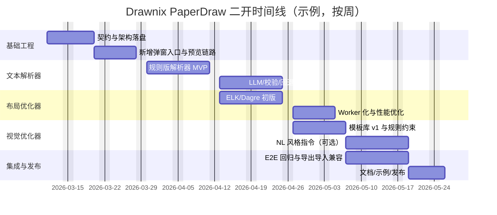

# Drawnix 二次开发分析报告：按 PaperDraw 论文思路从文本自动生成并优化流程图

## 执行摘要

本报告面向开发团队，目标是对 GitHub 项目 drawnix（develop 分支）进行二次开发，使其能够**按论文 PaperDraw 的三段式思路**（文本解析器 → 布局优化器 → 视觉元素优化器）从用户上传文本自动生成并优化流程图，并以可交付 PRD + 实施指南的形式给出可落地方案。fileciteturn0file0

drawnix 当前是一个基于 Plait 绘图框架的开源白板应用，采用 Nx Monorepo 结构，核心包与 React 视图层清晰分离，且已有“文本到图”（TTD, Text-to-Diagram）能力：支持 Mermaid 语法转流程图/序列图/类图，以及 Markdown 转思维导图，并可将生成的 PlaitElement 插入主画布。该能力的入口主要是 Extra Tools 菜单与弹窗式 TTD 对话框，内部通过动态 import 加载转换库并在只读 Board 里预览，再插入主 Board。citeturn5view0turn15view1turn16view0turn27view0turn27view1turn22view0

落地建议是：以现有 TTD 系统为“产品级入口”，新增第三种对话框类型（例如 `paperdrawToFlowchart`），引入三大新增子系统的契约化接口（统一中间表示 IR），并提供两套部署形态：  
一是**纯前端本地计算**（强调隐私与零后端依赖，适合轻量规则/小模型/ELK 布局）；二是**可选后端服务（REST）**（承载 LLM 推理、复杂优化、企业合规与缓存），前端仅负责交互与渲染。drawnix 的插件式架构和 `Wrapper` 对外暴露插件列表，天然支持新增插件/能力注入；同时其导出数据格式 `.drawnix` 已带版本号字段，可通过“向后兼容的可选字段扩展”承载生成元数据与风格模板信息。citeturn15view0turn22view0turn25view3turn26view2

---

## drawnix 仓库现状详尽审查

### 仓库定位、核心能力与技术栈

drawnix 是开源白板工具（SaaS 形态），强调“一体化画布”：思维导图、流程图、自由画笔、图片、导出（PNG/JPG/JSON .drawnix）、自动保存（浏览器存储）、主题，以及“支持 Mermaid 语法转流程图”“支持 Markdown 文本转思维导图”等文本转换能力。citeturn1view0turn5view0turn15view1

技术栈关键点（与本次二开强相关）如下：  
drawnix 采用 Nx Monorepo 分包，前端构建使用 Vite；核心绘图能力来自 Plait（插件机制、数据模型、缩放拖拽、与 React/Angular 的集成）；富文本基于 Slate；浏览器持久化使用 localforage（IndexedDB 优先、LocalStorage 回退）。citeturn5view0turn29view0turn36search1turn36search3turn36search6turn23view1

### Monorepo 结构、前后端分工与关键路径

drawnix 的仓库结构在 README 中明确给出（apps/web、packages/drawnix、packages/react-board、packages/react-text）。citeturn5view0turn6view0turn9view2turn4view0

* `apps/web`：最小可运行 Web 应用（drawnix.com 站点的最小实现）。入口 `apps/web/src/main.tsx` 渲染 `App`；`apps/web/src/app/app.tsx` 负责加载/保存本地数据，并将 `Drawnix` 作为主组件挂载。citeturn23view0turn23view1turn9view2  
* `packages/drawnix`：白板应用核心（业务层），包含 UI（工具栏/弹窗/菜单）、自定义插件、数据导入导出、i18n、主题与样式等。其 `Drawnix` 组件通过 `@plait-board/react-board` 的 `Wrapper`/`Board` 将插件与 UI 组合。citeturn13view0turn10view0  
* `packages/react-board`：React 视图层桥接，核心是 `Wrapper`（初始化 board + 插件链 + change 管道）与 `Board`（DOM/SVG 宿主、roughjs、事件绑定）。citeturn22view0turn22view1turn11view0  
* `packages/react-text`：文本渲染模块（基于 Slate）。仓库结构层面存在该包与其 `plugins/`、`styles/`、`text.tsx` 等文件，但本次调研受 GitHub 限流影响，具体实现细节在仓库内属于“未指定（本报告无法完整拉取所有源码行）”。citeturn11view1turn9view1

> 前后端分工：当前 `apps/web` 是纯前端站点，本地存储、导入导出、文本转图均在浏览器完成（未见后端服务目录）。因此本次二开若引入 LLM 推理/重优化服务，需要新增后端工程（“未指定”），或采用外部 API。citeturn23view1turn15view1turn36search6

### 关键数据流与状态流

#### 主数据流：用户交互 → PlaitBoard.operations → Wrapper 更新 → App 持久化

`Wrapper` 初始化 board 时，先将 `createBoard(value, options)` 依次包裹 `withText`、`withImage`、`withReact`、`withOptions`、`withI18n`、`withBoard`、`withMoving`、`withSelection`、`withHistory`、`withHandPointer`、`withHotkey`、`withRelatedFragment`，再遍历 `plugins` 参数将业务插件依次应用，并最后启用 `withPinchZoom`。这意味着：**drawnix 的扩展点之一就是向 Wrapper 的 `plugins: PlaitPlugin[]` 注入新插件**。citeturn22view0turn15view0

当 board 变化后，`Wrapper` 通过 `BOARD_TO_ON_CHANGE` 触发 `listRender.update(...)`，并根据 viewport/selection/theme 操作类型更新视口与元素激活区，最后触发 `BOARD_TO_AFTER_CHANGE` 调用 `onContextChange()`，从而把 `children/viewport/selection/theme/operations` 作为 `BoardChangeData` 回传给上层。citeturn22view0

`apps/web/src/app/app.tsx` 在 `onChange` 中把最新 `children/viewport/theme` 写入 localforage（键为 `main_board_content`），启动时读取并决定是否展示教程。citeturn23view1turn24view0

#### 应用状态：DrawnixContext（React）+ board.appState（桥接）

`packages/drawnix/src/hooks/use-drawnix.tsx` 定义了 `DialogType`（当前包含 `mermaidToDrawnix`、`markdownToDrawnix`）、`DrawnixPointerType`、`DrawnixState`（pointer、isMobile、isPencilMode、openDialogType、openCleanConfirm、linkState 等）以及 `DrawnixBoard extends PlaitBoard { appState: DrawnixState }`。这为“新能力入口（新增 DialogType）”提供了清晰挂载点。citeturn25view0turn15view2

### 关键模块、文件、类与函数

以下列出与“文本生成流程图 + 自动优化”最相关的关键路径（作用说明尽量贴近源码）：

#### 核心组件与插件装配

`packages/drawnix/src/drawnix.tsx`  
* `export type DrawnixProps`：Drawnix 组件输入，包括 `value: PlaitElement[]`、viewport/theme 及 onChange/onSelectionChange/onViewportChange/onThemeChange/onValueChange、afterInit、tutorial。citeturn13view0  
* `export const Drawnix: React.FC = (...) => { ... }`：核心白板组件；内部构造 `PlaitBoardOptions`，初始化 `appState`（含 `pointer/isMobile/isPencilMode/openDialogType/openCleanConfirm`），并构造 `plugins: PlaitPlugin[]`，包含：  
  * `withDraw`、`withGroup`、`withMind`：Plait 标准插件（流程图/基础形状、分组、思维导图）。citeturn13view0turn29view0  
  * `withMindExtend`：对 `@plait/mind` 的表情渲染与插件 options 扩展。citeturn13view0turn19view1  
  * `withCommonPlugin`：统一注入 `renderImage`、i18n 映射、并组合 `withImagePlugin`。citeturn13view0turn17view1turn18view1  
  * `buildDrawnixHotkeyPlugin(updateAppState)`：键盘快捷键（导出/保存/清空确认/工具切换等）。citeturn13view0turn14view2  
  * `withFreehand`：自由画笔（自定义几何类型 + 命中/框选/创建/擦除/fragment 支持）。citeturn13view0turn21view0turn21view2  
  * `buildPencilPlugin(updateAppState)`：检测 Pencil 事件并启用 pencil mode。citeturn19view2  
  *`buildTextLinkPlugin(updateAppState)`：文本链接 hover 状态与 link popup 交互。citeturn20view0  

这条插件链意味着：本次二开可选择“新增插件（withPaperDrawX）”或“沿用 TTD 弹窗入口新增 DialogType（paperdrawToFlowchart）”，两者可叠加：弹窗负责生成，插件负责对已插入元素二次优化（例如对选中区域做布局/样式一键优化）。

#### 文本到图（TTD）系统：可直接复用为本次入口

`packages/drawnix/src/components/toolbar/extra-tools/menu-items.tsx`  
* `MermaidToDrawnixItem`、`MarkdownToDrawnixItem`：点击后写入 `openDialogType`，打开对应弹窗。citeturn27view0turn25view0  

`packages/drawnix/src/components/ttd-dialog/ttd-dialog.tsx`  
* `TTDDialog`：根据 `openDialogType` 切换渲染 Mermaid/Markdown 输入面板（已有模式）。citeturn14view0turn15view1  

`packages/drawnix/src/components/ttd-dialog/mermaid-to-drawnix.tsx`  
* **动态加载** `@plait-board/mermaid-to-drawnix`；对输入 `text` 使用 `useDeferredValue`，在 effect 中 `parseMermaidToDrawnix(deferredText)` 得到 `{ elements }`；再通过 `insertToBoard()` 计算插入点与 bounding box，将 `elements` 作为 fragment 粘贴到主 board。citeturn16view0  

`packages/drawnix/src/components/ttd-dialog/markdown-to-drawnix.tsx`  
* 动态加载 `@plait-board/markdown-to-drawnix`，得到 `MindElement` 并插入 board。citeturn16view1  

`packages/drawnix/src/components/ttd-dialog/ttd-dialog-output.tsx`  
* 预览输出：在只读 `Wrapper+Board` 中挂载 `withDraw/withMind/withGroup/withCommonPlugin`，用于显示生成结果与错误提示。citeturn16view2turn17view1  

> 结论：**TTDDialog 是实现“用户上传文本 → 预览 → 插入画布”的最佳现成入口**，本次扩展应尽量复用其交互和工程模式（动态 import、deferred 输入、防抖、预览 board、插入时计算视口中心与 bounding box）。

#### 导入导出与文件格式：兼容性敏感点

`packages/drawnix/src/data/json.ts`  
* `saveAsJSON(board)`：将 `serializeAsJSON(board)` 的结果保存为 `.drawnix` 扩展名。citeturn25view3  
* `loadFromJSON(board)`：通过 File System API 打开文件并解析（iOS 兼容注释存在）。citeturn25view3  
* `serializeAsJSON(board)`：输出结构 `{ type:'drawnix', version:1, source:'web', elements, viewport, theme }`。citeturn25view3turn26view2turn26view0  
* `isValidDrawnixData`：校验 `type/elements/viewport`。citeturn25view3  

> 二开建议：新增元数据（如生成来源、IR、style template id）时，应以**可选字段**方式扩展 JSON，避免破坏 `isValidDrawnixData` 的最小校验。

---

## 三大新增子系统：目标、方案比较、接口定义与里程碑

本节以 PaperDraw 的“三段式生成系统”为总指导思想（文本解析器 → 可控布局优化器 → 视觉元素优化器），并结合 drawnix 现有 TTD 模式给出可落地的子系统契约。fileciteturn0file0

### 候选实现方案总体对比表

| 子系统 | 方案 A：大模型驱动（LLM / VLM / Tool Calling） | 方案 B：开源 NLP / 图算法库 | 方案 C：规则引擎 + 模板 | 推荐策略 |
|---|---|---|---|---|
| 文本解析器 | 语义理解强、可对论文式描述抽象出模块与关系；可通过函数调用输出结构化 IR（例如 OpenAI Responses API）citeturn38search3 | 中文任务可用 HanLP（分词/NER/dep/SRL 等）且提供 RESTful/native 两种形态citeturn40search0turn40search1 | 可控、可解释、成本低，但覆盖有限、维护成本随领域增长 | **LLM（主）+ HanLP（回退/校验）+ 规则兜底** |
| 布局优化器 | LLM 不擅长连续几何约束，除非配合约束求解器/搜索；更多适合生成约束而非算坐标 | ELK/elkjs 提供层次化布局（Sugiyama）与路由配置，适合有向流程图citeturn37search0turn37search2；Dagre 也可做 DAG 布局citeturn37search1 | 固定模板布局速度快但适应性差 | **ELK（主）+ 局部启发式优化（按论文指标）** |
| 视觉元素优化器 | 可根据目标风格生成配色/字体建议；可借鉴 NL2Color 的“自然语言调色板优化”范式citeturn7search7turn7search11 | 颜色/对比度/主题可用既有 theme + 色彩库（如 Chroma.js 说明为 BSD）citeturn42view0 | 以风格模板库做强一致性与可控性 | **模板库（主）+ 规则约束 + 可选 NL 指令优化** |

### 文本解析器：目标与功能清单

目标：从用户上传的自然语言文本（论文段落/方法描述/实验流程描述等）中抽取**流程图骨架**：节点（步骤/模块/数据/决策）、边（先后/依赖/数据流/控制流）、分组（模块/阶段）、权重（重要性/主支线），并输出统一 IR。fileciteturn0file0

功能清单（MVP → 增强）  
MVP：句段切分 → 步骤抽取 → 顺序边 → 节点类型识别（开始/结束/处理/决策/数据）→ 基础分组（章节/小标题/显式“阶段”词）。  
增强：依存/语义角色辅助关系抽取；并行/分支识别；跨句指代消解；与用户对话确认模块与权重（论文式 controllable generation）。fileciteturn0file0

接口定义（建议统一中间表示 IR）

```json
{
  "doc_id": "uuid",
  "language": "zh",
  "title": "从文本生成流程图",
  "nodes": [
    {
      "id": "n1",
      "label": "数据收集",
      "type": "process",
      "module": "数据准备",
      "weight": 0.9,
      "evidence": { "span": "我们首先收集数据……", "offset": [12, 28] }
    },
    { "id": "n2", "label": "清洗与标注", "type": "process", "module": "数据准备", "weight": 0.8 },
    { "id": "n3", "label": "模型训练", "type": "process", "module": "训练", "weight": 1.0 }
  ],
  "edges": [
    { "id": "e1", "source": "n1", "target": "n2", "type": "sequence", "label": "" },
    { "id": "e2", "source": "n2", "target": "n3", "type": "sequence", "label": "输入数据集" }
  ],
  "constraints": {
    "direction": "LR",
    "group_by_module": true,
    "prefer_orthogonal_edges": true
  }
}
```

性能/准确性/可扩展性要求  
响应：< 2s（文本 < 2k 字，MVP）；长文需增量与分段处理（异步进度条）。  
准确性：节点抽取 F1、边抽取 F1；对“必含步骤”召回优先（宁可多生成、后续交互删减）。  
扩展性：可插拔“领域词典/模板”（如生物实验/系统架构/算法 pipeline）。

依赖与风险  
依赖：LLM API（若采用）或本地模型；中文 NLP（如 HanLP 提供多任务与 RESTful/native 两种模式）。citeturn40search0turn40search1turn38search3  
风险：LLM 幻觉导致流程不忠实；专有/隐私文本合规；长文本 token 成本。需“证据 span + 置信度 + 用户确认”缓解。fileciteturn0file0

优先级与里程碑  
P0：IR 设计 + LLM/规则 MVP（可生成可插入的图）。  
P1：HanLP 校验/回退；分支/并行识别。  
P2：交互式澄清（类似论文式对话控制）。fileciteturn0file0

### 布局优化器：目标与功能清单

目标：对 IR 图结构生成**出版级**布局：减少交叉、对齐一致、留白均衡、路由清晰，支持模块分组与层次结构，并允许用户控制方向/紧凑度/模块排列策略（对应论文“可控布局优化”）。fileciteturn0file0

可选实现方案比较  
1) ELK/elkjs：ELK 是自动布局基础设施，elkjs 将其布局算法带到 JavaScript；其“layer-based layout（Sugiyama）”适合有向图与端口概念。citeturn37search0turn37search2  
2) Dagre：客户端有向图布局库，适合 DAG/层次布局，生态成熟、实现轻量。citeturn37search1  
3) 自研多目标优化：按论文设计目标函数（对齐、空间效率、连线路由等）做局部搜索/模拟退火/遗传；成本高但可逼近论文效果。fileciteturn0file0

输入输出接口（LayoutResult）

```json
{
  "layout_id": "uuid",
  "nodes": [
    { "id": "n1", "x": 0, "y": 120, "w": 180, "h": 64, "port_hints": ["E", "W"] },
    { "id": "n2", "x": 260, "y": 120, "w": 200, "h": 64 }
  ],
  "edges": [
    { "id": "e1", "routing": [[180,152],[220,152],[260,152]], "style": "orthogonal" }
  ],
  "groups": [
    { "id": "g_data", "node_ids": ["n1","n2"], "x": -20, "y": 80, "w": 520, "h": 140 }
  ],
  "metrics": { "crossings": 0, "edge_length_sum": 420, "whitespace_ratio": 0.32 }
}
```

性能/可扩展性要求  
* 节点数 ≤ 50：布局 < 300ms（交互式）；≤ 200：< 2s（后台 worker）。  
* 支持并发：布局计算置于 Web Worker，避免阻塞 UI（ELK/elkjs 社区常用 worker 形态，且 ELK 不负责渲染只负责位置计算的定位也明确）。citeturn37search0turn37search4  
* 可扩展：能接入“模块分组（group）”“固定节点（pin）”“方向约束（LR/TB）”“对齐约束（grid）”。

依赖与风险  
依赖：elkjs/dagre；以及 Plait 元素尺寸测量（文本尺寸会影响节点宽高）。现有 Mermaid 转换链路已使用 `measureElement` 来测文本尺寸，说明尺寸测量在系统中是常规能力。citeturn35view0  
风险：布局与 Plait 元素 schema/连接点不匹配导致连线绑定错误（需严格对齐 `ArrowLineHandle.boundId/connection` 的语义）。citeturn35view0

优先级与里程碑  
P0：ELK/Dagre 初版（只要“能看、少交叉”）。  
P1：按论文原则做二次优化（对齐、间距、分组边界、正交路由）。fileciteturn0file0  
P2：对“已插入图”做一键重排（选择区域优化）。

### 视觉元素优化器：目标与功能清单

目标：在结构与布局确定后，优化视觉编码，使流程图更“论文级”：形状语义一致、模块配色一致、线条/字体统一、可读性提升，并支持用户用自然语言提出风格（“更正式/更简洁/更科技感”）。fileciteturn0file0

方案比较  
* 模板库：强一致、可控、可复现实验风格；适合产品化。  
* 规则引擎：将设计规范固化为规则（例如 json-rules-engine 这类 JSON 规则引擎便于持久化与人类可读）。citeturn39search3  
* NL 风格指令：借鉴 NL2Color 的思路，用自然语言调整调色板（NL2Color 研究将自然语言表达与调色板优化结合）。citeturn7search7turn7search11

输入输出接口（StylePlan）

```json
{
  "palette": {
    "module:数据准备": "#4E79A7",
    "module:训练": "#F28E2B",
    "default_border": "#2F2F2F",
    "default_text": "#111111"
  },
  "typography": { "font_family": "Inter", "font_size": 18, "line_height": 1.2 },
  "shapes": {
    "start_end": "terminal",
    "process": "rectangle",
    "decision": "diamond",
    "data": "parallelogram"
  },
  "edges": { "style": "orthogonal", "stroke_width": 2, "arrow": "stealth" },
  "constraints": { "min_contrast_ratio": 4.5 }
}
```

风险  
* 颜色/对比度不达标导致可读性差；建议加入对比度检查（WCAG 之类指标属于通行工程实践，报告不展开引用规范条文）。  
* 主题与 Plait 现有 ThemeColorMode 冲突：drawnix/Plait 体系已有主题色模式与经典色定义，应优先复用并以“模板→主题模式映射”方式落地。citeturn26view3turn21view3turn13view0

里程碑  
P0：基于模块分组的配色 + 形状映射（不引入 LLM）。  
P1：加入自然语言风格指令（可选），参考 NL2Color 的“自然语言→调色板”范式。citeturn7search7turn7search11  
P2：风格模板库与风格检索（论文 style vector library 思路）。fileciteturn0file0

---

## 三大子系统详细技术方案

> 本节给出“可直接开工”的工程方案：模型/算法候选、部署、协议、回退、测试与指标。若团队规模/训练数据/部署环境未指定，则在相应处标注“未指定”。

### 文本解析器技术方案

#### 算法与模型候选

优先级建议（由高到低）：

* LLM 结构化抽取（优先级 A）：使用工具/函数调用让模型直接输出 IR JSON，并强制 schema 校验（例如 OpenAI Responses API 属于统一的响应接口形态，可用于生成结构化输出）。citeturn38search3  
* 开源中文 NLP（优先级 B）：HanLP 提供分词、NER、依存、SRL 等多任务能力，并同时提供 RESTful 与 native API，适合“本地解析/服务化解析/离线解析”多形态部署。citeturn40search0turn40search1  
* 规则/模板（优先级 C）：用 JSON 规则引擎表达领域规则（例如 json-rules-engine 主打 JSON 规则、可读且易持久化）。citeturn39search3  

#### 训练/微调需求

* MVP：不做微调，采用提示词 + few-shot + schema 校验。  
* 增强：收集“文本 → IR”标注样本（未指定样本规模），做指令微调或 RAG（用企业内部范式库/论文模板库检索增强）。fileciteturn0file0

#### 推理与部署方式

* 本地：规则 + HanLP（native/RESTful）适合隐私敏感文本；  
* 云：LLM API 适合快速迭代、效果更强；  
* 混合：本地先抽取候选 → 云端 LLM 做结构修正与补全 → 本地校验回填。

> 若要引入开源 LLM，本报告仅给出“许可需审查”的候选示例：Qwen（开源系列）citeturn38search0turn38search4、DeepSeek（模型有自建许可/FAQ）citeturn38search5turn38search1、Llama 3（社区许可协议）citeturn38search10turn38search2。实际选型需结合企业合规（未指定）。

#### 接口协议建议

* 前端本地模块：TypeScript `parseTextToIR(text, options): Promise<FlowIR>`。  
* 可选 REST：`POST /api/paperdraw/parse` 输入文本与配置，输出 FlowIR（JSON）。

示例请求/响应（REST）

```http
POST /api/paperdraw/parse
Content-Type: application/json

{
  "text": "本文提出……我们首先收集数据，然后清洗标注，之后训练模型……",
  "lang": "zh",
  "mode": "llm+nlp",
  "constraints": { "direction": "LR" }
}
```

```json
{
  "ok": true,
  "flow_ir": { "...": "见上一节 IR 示例" },
  "debug": { "llm_used": true, "fallback_used": "hanlp" }
}
```

#### 错误处理与回退策略

* schema 校验失败：要求模型重试（带错误信息的 self-correct prompt）；  
* LLM 超时/失败：回退 HanLP+规则；  
* 解析低置信度：进入“澄清问题”模式（弹窗内 UI 询问用户补充模块划分/关键节点）。

#### 测试用例与指标

测试用例（最少集示例）  
* 单链条：A→B→C  
* 含分支：A→(B/C)→D（决策节点）  
* 含并行：A→(B||C)→D  
* 含模块：数据准备/训练/评估三组

指标  
* Node F1、Edge F1（与人工标注对比）  
* “证据覆盖率”：节点有 evidence span 的比例（越高越可解释）。fileciteturn0file0

### 布局优化器技术方案

#### 算法选择与优先级

优先级 A：ELK/elkjs layered  
ELK/elkjs 明确强调其旗舰是“layer-based（Sugiyama）”并适合具有方向的 node-link diagram；elkjs 本身不是绘图库，只计算位置。citeturn37search0turn37search2

优先级 B：Dagre layered  
Dagre 是客户端有向图布局库，定位明确（directed graph layout）。citeturn37search1

优先级 C：自研论文式二次优化  
PaperDraw 的布局优化强调对齐、空间效率、尺寸标准化、连线路由、颜色编码一致等原则，并提出专门的路由/布局优化方法（本报告按论文思路复现为二次优化层）。fileciteturn0file0

#### 工程实现建议

分两层：

1) 初始布局（ELK）  
输入节点尺寸（w/h）与边，输出节点坐标（x/y）与边路由点（如启用 orthogonal routing）。

2) 二次优化（论文式启发式）  
* 对齐：将同层节点 y 对齐、同列节点 x 对齐（栅格化）。  
* 间距：根据节点密度自适应 spacing。  
* 分组：为 module group 计算边界框并留 padding。  
* 路由：将边尽量正交、减少穿越 group。  
* 指标驱动迭代：若 crossings>0 或 whitespace_ratio 过高则做局部交换/移动。

由于 drawnix 已存在“从 Mermaid 布局点位生成 Plait 元素”的成熟做法，可直接复用其元素创建与连接绑定逻辑：`createGeometryElement`、`createArrowLineElement`、`ArrowLineHandle.boundId/connection` 等。citeturn35view0

#### 部署与并发

* 前端：布局放入 Web Worker；主线程只做渲染与交互。  
* 后端：若布局规模非常大，可放入服务端（未指定）。

#### 测试与评估指标

自动指标  
* crossings（交叉数）  
* edge_length_sum（总边长）  
* aspect ratio（整体长宽比）  
* whitespace_ratio（空白占比）

回归测试  
* 同一 IR 多次布局应稳定（seed 固定），避免“每次点击都变”的体验。

### 视觉元素优化器技术方案

#### 候选策略与优先级

优先级 A：模板库 + 规则  
* 按节点类型映射形状：terminal/rectangle/diamond 等。  
* 按 module 分配颜色，并保证同模块一致。drawnix 已存在经典色板 `CLASSIC_COLORS` 与多种主题色模式（如 FreehandThemeColors）。citeturn26view3turn21view3

优先级 B：自然语言风格指令  
参考 NL2Color：该研究提出用自然语言表达来优化图表调色板。citeturn7search7turn7search11  
在本项目中可以落地为：用户输入“更正式/更柔和/对比更强”，系统调整 palette 与线宽、圆角、背景填充等。

优先级 C：论文式风格检索（style vector library）  
PaperDraw 提到构建风格向量库并用结构相似性检索匹配风格（属于高阶增强，待二期）。fileciteturn0file0

#### 与 Plait/drawnix 的结合点

`@plait-board/mermaid-to-drawnix` 的 flowchart converter 里已经展示了“顶点类型 → 图形形状”的映射：如 `VERTEX_TYPE.STADIUM → FlowchartSymbols.terminal`、`DIAMOND → BasicShapes.diamond`，并支持读入 mermaid 的 containerStyle/labelStyle 生成节点样式。citeturn35view0turn34view0  
这意味着我们可以：  
* 将视觉优化输出映射为 `createGeometryElement(..., styleOptions, ...)` 的 `fill/strokeColor/strokeWidth`；citeturn35view0  
* 将边样式映射为 `createArrowLineElement(..., arrowOptions)`。citeturn35view0  

---

## 整体系统集成方案

### 端到端模块交互流程图

下面给出推荐的整体流程（复用现有 TTDDialog 入口，新增 PaperDraw 生成分支）：

```mermaid
flowchart LR
  U[用户上传/粘贴文本] --> UI[Drawnix: 新增 PaperDraw 弹窗]
  UI -->|文本+配置| P0[文本解析器 Text Parser]
  P0 --> IR[统一中间表示 FlowIR]
  IR --> P1[布局优化器 Layout Optimizer]
  P1 --> LR[LayoutResult]
  LR --> P2[视觉元素优化器 Visual Optimizer]
  P2 --> EP[ElementPlan: style+shape]
  EP --> C[PlaitElement Builder]
  C --> PV[只读预览 Board (TTDDialogOutput)]
  PV -->|确认插入| INS[board.insertFragment]
  INS --> MAIN[主画布 PlaitBoard]
  MAIN --> SAVE[localforage 自动保存]
```

其中“只读预览 Board”是现有 `TTDDialogOutput` 的模式：用 `Wrapper+Board` 并配置 `readonly:true`，可直接复用。citeturn16view2turn22view0turn23view1

### 数据格式转换与向后兼容

* 内部新增 `FlowIR/LayoutResult/StylePlan` 为“生成过程内部数据”，默认不写入 `.drawnix` 文件。  
* 若要支持“可追溯与可重生成”，建议在 `.drawnix` JSON 中添加可选字段：

```json
{
  "type": "drawnix",
  "version": 1,
  "source": "web",
  "elements": [/*...*/],
  "viewport": { "zoom": 1 },
  "theme": { /*...*/ },
  "paperdraw": {
    "flow_ir": { /* 可选：压缩存储或仅存 hash */ },
    "style_template": "paper.default.v1",
    "generated_at": 1700000000
  }
}
```

因为当前校验函数只检查 `type/elements/viewport`，额外字段不会破坏最小校验（但仍需回归测试）。citeturn25view3turn26view0

### 并发与异步策略

* 解析与布局放入 Worker：避免阻塞主线程（尤其 ELK 布局）。citeturn37search0turn37search4  
* 采用 AbortController：在用户继续输入或关闭弹窗时取消正在进行的任务；drawnix 已有 `AbortError` 类型可复用。citeturn13view3  
* 复用 `useDeferredValue`：现有 Mermaid/Markdown 转换已通过 deferred text 降低频繁计算。citeturn16view0turn16view1

### CI/CD 与自动化测试建议

drawnix 子包 README 提到 `nx test` + Vitest；结合 Nx 的一致命令与 monorepo 管理能力，可将新增子系统以独立库包或 packages/drawnix 子模块形式纳入 Nx target。citeturn8view0turn36search0turn22view0  
建议 CI：  
* `nx format:check`（若存在）、`nx lint`、`nx test drawnix react-board react-text web`  
* 增加 E2E：针对“输入文本→预览→插入→导出 .drawnix→重新导入”做端到端回归（未指定框架，可选 Playwright/Cypress）。

---

## 分阶段开发计划与 PRD

### 里程碑任务清单、验收标准与工时估算

> 人员配置：未指定（按“人日”给出粗估）。工时会随是否引入后端与 LLM 而显著变化。

**里程碑 A：架构落盘与接口契约（约 5–8 人日）**  
* 任务：确定 `FlowIR/LayoutResult/StylePlan` TypeScript 类型；定义错误码与回退策略；确定是否引入后端。  
* 验收：给出可运行的接口 mock；本地可通过单测构造一个 IR 并生成简单 PlaitElement[]。

**里程碑 B：新增 PaperDraw 弹窗入口（约 4–6 人日）**  
* 任务：扩展 `DialogType`（新增 `paperdrawToFlowchart`）；在 `extra-tools/menu-items.tsx` 增加入口；在 `TTDDialog` 中增加第三页；复用 `TTDDialogOutput` 做预览。citeturn25view0turn27view0turn14view0turn16view2  
* 验收：UI 可打开；输入文本后调用 mock pipeline，预览显示并可插入主画布。

**里程碑 C：文本解析器 MVP（约 10–15 人日）**  
* 任务：实现规则版节点/边抽取；可选接入 LLM API（未指定）；增加 schema 校验与 evidence span。  
* 验收：至少覆盖 10 条测试用例（含分支/并行/模块）；Node/Edge F1（对内部标注小集）达到基线（未指定）。

**里程碑 D：布局优化器 v1（约 8–12 人日）**  
* 任务：引入 ELK 或 Dagre；将 LayoutResult 映射到 PlaitElement 坐标；边路由正交化；Worker 化。citeturn37search0turn37search1turn35view0  
* 验收：50 节点内 < 300ms（主流设备）；交叉数显著低于 naive 布局（定义基线并记录）。

**里程碑 E：视觉元素优化器 v1（约 6–10 人日）**  
* 任务：形状映射（terminal/decision/process）；模块配色（复用 CLASSIC_COLORS/主题）；对比度检查；模板库 v1（3 套）。citeturn26view3turn35view0turn21view3  
* 验收：模板可切换；同模块颜色一致；导出 PNG/JPG/JSON 不异常。citeturn25view2turn25view3

**里程碑 F：论文式增强与产品化（约 10–20 人日）**  
* 任务：加入交互式澄清与权重控制；布局二次优化按论文指标迭代；保存 paperdraw 元数据（可选）。fileciteturn0file0  
* 验收：对给定样本文本生成图达到“可直接用于论文方法图”的人工评审基线（评审规则未指定）。

### 时间线甘特图（示例）



### 示例前端交互原型说明（文字版）

沿用现有 Mermaid/Markdown TTD 弹窗交互模型：  
左侧“输入区”（支持上传 txt/md/pdf 抽取后的纯文本 —— pdf 抽取在本报告不展开，属于未指定）；右侧“预览区”（只读 board）；底部按钮：`分析生成`、`重新布局`、`应用风格`、`插入到画布`、`复制 IR JSON`。

---

## 第三方资源清单、许可证注意事项与扩展建议

### 第三方资源清单（按优先级）

布局  
* elkjs：将 ELK 布局算法带到 JavaScript，适合有向 node-link 图的层次布局。citeturn37search0turn37search2  
* dagre：轻量有向图布局库。citeturn37search1  
* graphviz：若服务端生成（非本次默认），需注意其许可证页面信息（EPL 等）。citeturn37search3turn37search7  

文本解析  
* HanLP：中文 NLP 工具包，提供 RESTful/native 两种 API，适合工程落地。citeturn40search0turn40search1  
* spaCy：英文/多语言 NLP，MIT 许可（如需英文论文流程解析可选）。citeturn39search6turn39search2  
* json-rules-engine：JSON 规则引擎，适合作为规则兜底与可解释层。citeturn39search3  

LLM（可选）  
* OpenAI Responses API（若使用 OpenAI）。citeturn38search3  
* 开源模型许可示例：Qwen、DeepSeek、Llama 3（落地前需企业合规复核）。citeturn38search0turn38search5turn38search10  

色彩与风格  
* NL2Color（研究参考）：自然语言调色板优化思路可借鉴到“流程图主题优化”。citeturn7search7turn7search11  
* Chroma.js：颜色转换/调色板工具，其 README 声明 BSD license（注意历史版本差异与 license 文件一致性需复核）。citeturn42view0  

绘图框架与集成（现有依赖）  
* Plait：插件机制、与 React/Angular 集成、文本渲染基于 Slate 的定位在 README 中明确。citeturn29view0turn36search3  
* localforage：异步存储（IndexedDB/WebSQL）+ localStorage-like API，并在无 IndexedDB/WebSQL 时回退 localStorage。citeturn36search6turn23view1  
* Vite、Nx：构建与 Monorepo 工程工具。citeturn36search1turn36search0  

### 许可证注意事项（工程落地要点）

* drawnix 本体使用 MIT License（仓库 README 提及）。citeturn5view0turn31view0  
* 引入 EPL/CPL 等“弱 copyleft/带附加义务”的库（如 Graphviz 生态）需法务评估，尤其是分发与 SaaS 场景差异。citeturn37search3turn37search7  
* 中文 NLP 工具存在商业限制的情况（例如 LTP 镜像页声明商业用途需付费/洽谈，因此不建议作为默认依赖）。citeturn39search5  
* 开源大模型许可证差异大（Qwen/DeepSeek/Llama 等均需逐条审查可接受用途）。citeturn38search5turn38search10turn38search0  

### 替代方案与扩展功能建议

交互式编辑增强  
* “生成后可编辑”：保持生成元素为标准 Plait draw 元素（矩形/菱形/箭头线），用户可继续拖拽与修改（这与 Mermaid→Drawnix 的产物一致）。citeturn35view0turn16view0  
* “选区一键优化”：对选中元素调用 Layout/Style 优化器重排，类似“格式刷/一键美化”。

用户反馈循环  
* 记录用户对生成结果的修改（节点删除/重命名/移动），形成“偏好样本”，用于改进解析与样式推荐（训练/微调规模未指定）。fileciteturn0file0

可视化风格模板库  
* 提供“论文风格”“极简黑白”“科技蓝”“期刊配色”等模板；  
* 模板可映射到 drawnix 已有 ThemeColorMode 与 CLASSIC_COLORS，以减少与现有系统冲突。citeturn26view3turn13view0

更进一步的文本到图能力  
* 在现有 Mermaid/Markdown 之外，新增 “自然语言→流程图（PaperDraw）”第三入口；并可在后台输出 Mermaid 作为可导出中间产物（便于与外部生态互通），同时在 UI 提供“一键复制 Mermaid”。citeturn15view1turn31view0

---

**附：与现有系统对齐的开发落点总结（最重要的三条）**  
一是复用 `TTDDialog` 的“输入-预览-插入”产品路径；二是以 `FlowIR → LayoutResult → StylePlan → PlaitElement[]` 建立稳定契约；三是以 `Wrapper.plugins` 与 `DialogType` 作为主要扩展点，实现“新增能力最小侵入”。citeturn22view0turn25view0turn16view2turn27view0